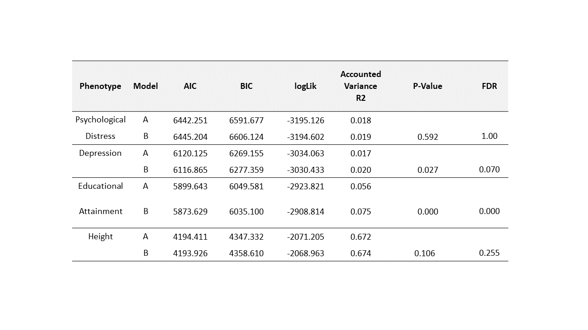
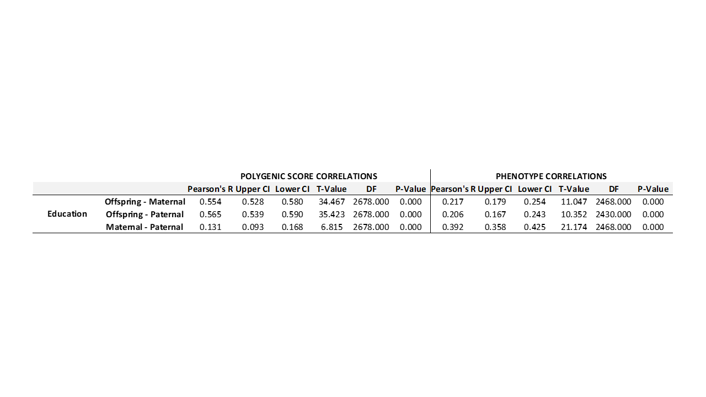
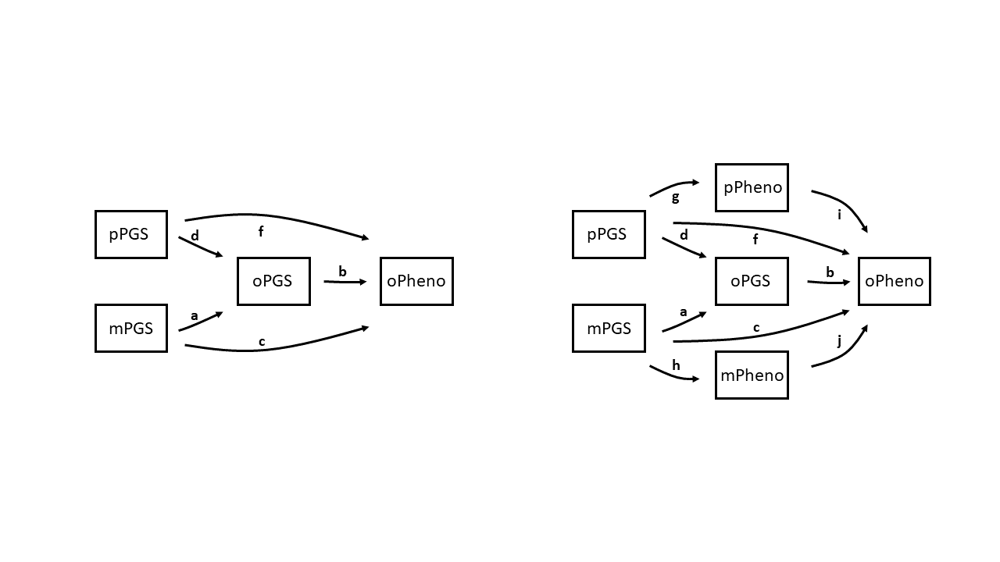

```{r setup, include=FALSE}
knitr::opts_chunk$set(echo = TRUE)
```

# Explore Indirect Genetic Effects using Regressions and Pathway Analyses
# Aim 
I will be using trio's full polygenic risk scores (PGSs) rather than splitting PGSs into transmitted and non-transmitted counterparts.

```{r, eval=FALSE}
library(lme4)
library(lavaan)
library(dplyr)
```

# GS TRIOS  

Genotyped data and pedigree files can be found on datastore @   /exports/igmm/eddie/GenScotDepression/data/genscot/genetics/genotypes/GS20K_PLINK_files/QCd_data   
*These files are saved as GS_QC.bed/.bim/.fam*  

I find genotyped GS trios using the pedigree file available, from this we create a GS_trio file.

```{r, eval=FALSE}
rm(list=ls())

fam <- read.table("GS_QC.fam") #this file was renamed for convenience 
colnames(fam) <- c("FID", "IID", "PID", "MID", "SEX", "PHENO")

fatherpresent <- fam[fam$PID%in%fam$IID,] #Finding PIDs also present in the IID column - every individual in the IID column in the pedigree file has genotyped data#
dim(fatherpresent) #fatherduo n= 3,865

motherpresent <- fam[fam$MID%in%fam$IID,] #Finding MIDs also present in the IID column#
dim(motherpresent) #motherduo n=5,954

trio <- fam[fam$PID%in%fam$IID & fam$MID%in%fam$IID,] #Finding trios, i.e. individuals with both PIDs and MIDs present in the IID column#

write.table(trio, "GS_trio", row.names=F, quote=F)
#n= 2680 genotyped trios available in Generation Scotland
```

# PHENOTYPES {.tabset}  

Our phenotype of interest is educational attainment, defined as 'years of education'.  
EA is provided on a likert scale from 1-10, with higher values suggesting a greater number of years of education. We can find this in the masterDB.Rdata file which can found on datastore @/exports/igmm/GenScotDepression/data/genscot/phenotypes/masterDB.Rdata  

## Educational Attainment

Hist + variance + sd of whole sample

```{r, eval=FALSE}
rm(list=ls())

df <- load("masterDB.Rdata")
which(colnames(totaldata)=="years_category")

ea <- totaldata[,c(1,41,79)]
ea <- ea[,c(3,1,2)]

colnames(ea) <- c("FID", "IID", "EA")
hist(ea$EA, col="pink")
summary(ea) 
dim(ea)

write.table(ea, "GSea", row.names=F, quote=F)

```

## QC Phenotype  

Removing phenotype values that are greater or less than 4 standard deviations away from the mean (i.e. outliers!) - after controlling for AGE and SEX!  
Age and sex variable files provided by Carmen Amador.   

No outliers are present for the EA phenotype
```{r, eval=FALSE}

age <- read.table("GS_Ages.qcovar", header=T)
age <- age[,1:3]
colnames(age) <- c("FID", "IID", "AGE")

sex <- read.table("GS_SexClinic.fcovar", header=T)
sex <- sex[,1:3]
colnames(sex) <- c("FID", "IID", "SEX")

cov <- merge(age, sex, by=c("FID", "IID"))

df1 <- merge(ea, cov, by=c("FID", "IID")) #n=20,026

#We need to remove individuals with NA data
df1 <- df1[complete.cases(df1),] #n=18,921

#Regressing out the effects of AGE and SEX
reg <- lm(EA~AGE+SEX, data=df1)
res <- data.frame(FID=df1$FID, IID=df1$IID, EA_res=residuals(reg))

summary(res$EA_res)
sd(res$EA_res)

outlierIDs_positive <- subset(res, res$EA_res>mean(res$EA_res)+4*sd(res$EA_res))
outlierIDs_negative <- subset(res, res$EA_res<mean(res$EA_res)-4*sd(res$EA_res))

#No outliers! 

trio <- read.table("GS_trio", header=T)
df2 <- merge(trio, ea, by=c("FID", "IID"), all.x=T)
colnames(ea)[2:3] <- c("MID", "mEA")
df3 <- merge(df2, ea, by=c("FID", "MID"), all.x=T)
colnames(ea)[2:3] <- c("PID", "pEA")
df4 <- merge(df3, ea, by=c("FID", "PID"), all.x=T)

```

## Phenotype Demographics  

hist + var + sd (offspring)
```{r, eval=FALSE}
#offspring EA demographics

df4 <- df4[complete.cases(df4),] #Using trios with COMPLETE data; n=2,368
hist(df4$EA, col="cadetblue3")

summary(df4$EA)
var(df4$EA)
sd(df4$EA)
```

hist + var + sd (maternal)
```{r, eval=FALSE}
#maternal EA demographics

hist(df4$mEA, col="lightpink1")

summary(df4$mEA)
var(df4$mEA)
sd(df4$mHEA)

```

hist + var + sd (paternal)
```{r, eval=FALSE}
#paternal EA demographics

hist(df4$pEA, col="darkolivegreen3")

summary(df4$pEA)
var(df4$pEA)
sd(df4$pEA)

```


# POLYGENIC RISK SCORES {.tabset}  

We will use PRSice2 (Choi & O'Reilly., 2019) to generate the PRSs. We will pre-correct our phenotypes for covariates. We will use 1000G as a reference panel for LD estimation which will go onto guide pruning and clumping of SNPs. 

Covariates include the first 20 principle components from a Genomics Relatedness Matrix of GS data, age and sex.   

PCs can be found on datastore @ /exports/igmm/datastore/GenScotDepression/data/genscot/genetics/genotypes/GS20K_PLINK_files/PCA_MDS_components/HM3mds.mds  

Age and sex covariate data is provided by Carmen Amador @   /gpfs/igmmfs01/eddie/haley-lab/melisa/dataformelisa/GS_SexClinic.fcovar / GS_Ages.qcovar  

We are creating EA PRSs for EVERYONE with EA data in GS, not just trios - this allows the effects of covariates to be controlled for with a little more accuracy.  

## Covariate Correction  

```{r, eval=FALSE}
library(dplyr)

age <- read.table("GS_Ages.qcovar", header=T)
head(age)
age <- age[,c(1:3)]
colnames(age) <- c("FID", "IID", "AGE")
dim(age)

sex <- read.table("GS_SexClinic.fcovar", header=T)
head(sex)
sex <- sex[,c(1:3)]
colnames(sex) <- c("FID", "IID", "SEX")
sex$SEX <- as.factor(sex$SEX)
dim(sex)

pcs <- read.table("HM3mds.mds", header=T)
pcs <- distinct(pcs, IID, .keep_all = TRUE) #Some IIDs are repeated, so need to sort this out#
head(pcs)
pcs <- pcs[,-c(1,3)]
dim(pcs)

cov <- merge(age, sex, by=c("FID","IID"))
cov <- merge(cov, pcs, by="IID")
dim(cov)

colnames(ea) <- c("FID", "IID", "EA")
df1 <- merge(ea, cov, by=c("FID","IID"))
df1 <- df1[complete.cases(df1),]
dim(df1)

res <- lm(EA~C1+C2+C3+C4+C5+C6+C7+C8+C9+C10+C11+C12+C13+C14+C15+C16+C17+C18+C19+C20+AGE+SEX, data=df1)
summary(res)
result <- data.frame(FID=df1$FID, IID=df1$IID, EA_res=residuals(res))

write.table(result, "GSea_res", row.names=F, quote=F)

```

1000G files need to be in the format of plink1 files. Plink2 versions are available on datastore @ /exports/igmm/datastore/GenScotDepression/data/resources/1000g/PGEN

Need to convert vzs plink2 versions of files to .bed\.bim\.fam plink1 versions
plink2.00 is used for this 

```
plink --pfile all_phase3 --max-allele 2 --make-bed --out all_phase3

```
## Computing PGS   

We will use:

Base data: EA GWAS meta-analysis sumstats  ~ Lee et al., 2018 (removing 23&Me + GS data) N= 1,131,880-381,477 =750,403  

LD data: 1000G LD structure (see above)  

Phenotype data: The GSea_res file we created above. This is EA for all GS participants with the effects of age, sex and 20PCs removed  

Target data: Will be the available plink files for GS; GS_QC.bed, GS_QC.bim, GS_QC.fam  

We will be creating different PRSs whereby the number of SNPs used to inform the PRSs will be dependent on the SNPs p-value GWAS association with the trait. We use 10 different p-value association thresholds ranging from 5x10-8 : 1.  

Shell script

```
#!/bin/sh
###########################################

# M.Chuong, Edinburgh U.K, January2020
# Eddie Depression PRSice GS Script

#$ -N GenScotEAPRS
#$ -cwd
#$ -pe sharedmem 2 # number of cores
#$ -l h_vmem=40G # memory per core
#$ -l h_rt=12:00:00 ## requested time
#$ -m baes ## notifications: (b)begin/(a)aborted/(e)end/(s)suspended/(n)nomail
#$ -M melisa.chuong@ed.ac.uk ## email for notifications

# INITIALISE ENV MODULES
. /etc/profile.d/modules.sh # if using modules need to add this line
# LOAD THE MODULES
module load igmm/apps/R/3.3.3


Rscript PRSice.R\ 
--dir .\ 
--prsice ./PRSice_linux\
--base EA3_excl_23andMe_GSII.meta\ 
--target GS_QC\ 
--thread 1\ 
--print-snp\ 
--beta\ 
--stat BETA\ 
--binary-target F\ 
--snp MarkerName\ 
--A1 EA\ 
--A2 OA\ 
--se SE\ 
--pvalue P\ 
--bar-levels 0.00000005,0.0000005,0.000005,0.00005,0.0005,0.005,0.05,0.5,0.75,1\ 
--fastscore\ 
--all-score\ 
--ld all_phase3\ 
--pheno-file GSea_res\ 
--pheno-col EA_res\ 
--out GSea

```
Summary of generated PRSs  
Currently, PRSs informed by SNPs exceeding the genome-wide p-value threshold of 1 accounts for the greatest amount of variance in comparison to the other PRSs.
Presented is a histogram of the standardised PRSs.

```{r, eval=FALSE}

rm(list=ls())

prs <- read.table("GSea.all.score", header=T)
head(prs)
prs <- prs[,c(1:2,9)]
colnames(prs)[3] <- c("eaPRS_0.05") 

prs$eaPRS_0.05 <- scale(prs$eaPRS_0.05)
hist(prs$eaPRS_0.05, col="orange")#distribution seems normal
```

EA PRS - EA summary
```{r, eval=FALSE}
ea_prs <- read.table("GSea.prsice")
ea_prs

```
  


# SANITY CHECKS {.tabset}  

## Sanity Check Dataframe     

Dataframe has ALL variables standardised

```{r, eval=FALSE}

df <- read.table("GS_trio", header=T)
df <- df[,c(1:4)]

GSea <- read.table("GSea", header=T)
GSea[,3] <- scale(GSea[,3])

df1 <- merge(df, GSea, by=c("FID", "IID"), all.x=T)

colnames(GSea)[2:3] <- c("MID", "mEA")
df2 <- merge(df1, GSea, by=c("FID", "MID"), all.x=T)

colnames(GSea)[2:3] <- c("PID", "pEA")
df3 <- merge(df2, GSea, by=c("FID", "PID"), all.x=T)

colnames(prs)[2:3] <- c("IID","eaPRS_0.05")
df4 <- merge(df3, prs, by=c("FID", "IID"))

colnames(prs)[2:3] <- c("MID","meaPRS_0.05")
df5 <- merge(df4, prs, by=c("FID", "MID"))

colnames(prs)[2:3] <- c("PID","peaPRS_0.05")
df6 <- merge(df5, prs, by=c("FID", "PID"))

age <- read.table("GS_Ages.qcovar", header=T)
age <- age[,c(1:3)]
age[,3] <- scale(age[,3])
colnames(age) <- c("FID", "MID", "mAGE")

df7 <- merge(df6, age, by=c("FID", "MID"))
colnames(age) <- c("FID", "PID", "pAGE")
df8 <- merge(df7, age, by=c("FID", "PID"))

library(dplyr)

colnames(age)[2:3] <- c("IID", "AGE")
sex <- read.table("GS_SexClinic.fcovar", header=T)
head(sex)
sex <- sex[,c(1:3)]
colnames(sex) <- c("FID", "IID", "SEX")
sex$SEX <- as.factor(sex$SEX)
dim(sex)

pcs <- read.table("HM3mds.mds", header=T)
pcs <- distinct(pcs, IID, .keep_all = TRUE) #Some IIDs are repeated, so need to sort this out#
pcs <- pcs[,-3]
pcs[,3:22] <- scale(pcs[,3:22])

cov <- merge(age, sex, by=c("FID","IID"))
cov <- merge(cov, pcs, by=c("FID", "IID"))
dim(cov)

df9 <- merge(df8, cov, by=c("FID", "IID"))
dim(df9)
names(df9)

write.table(df9, "IGE_ea_PRS_df", row.names=F, quote=F)

```

## Covariates; Model or Pre-correct?  

To check whether I should use pre-corrected EA phenotypes or alternatively model the covariates, I run regression analyses $$ Educational Attainment \sim eaPRS + COV $$ vs $$ Educational Attainment(residualised) \sim eaPRS $$  

Results below show difference to be quite minimal, as many regression models will be implemented I will use the precorrected DV method to make results easier to read.  

```{r, eval=FALSE}

prs <- read.table("GSea.all.score", header=T)
prs[,3:12] <- scale(prs[,3:12])

colnames(GSea)[2:3] <- c("IID", "EA")
df <- merge(GSea, prs, by=c("FID","IID"), all.x=T)
df2 <- merge(df, cov, by=c("FID", "IID"), all.x=T)
df2 <- df2[complete.cases(df2),]

#pre-correct outcome variables, so output for the regressions for each PRS is not too large#

reg <- lm(EA~C1+C2+C3+C4+C5+C6+C7+C8+C9+C10+C11+C12+C13+C14+C15+C16+C17+C18+C19+C20+AGE+SEX, data=df2)
EA_res <- data.frame(FID=df2$FID, IID=df2$IID, EA_res=residuals(reg))

df3 <- merge(df2, EA_res, by=c("FID", "IID"))

#Check to see if I get similar results with covariates modelled vs pre-corrected variables, n=19,915
```

```{r, eval=FALSE}
test <- lm(EA~X0.05+C1+C2+C3+C4+C5+C6+C7+C8+C9+C10+C11+C12+C13+C14+C15+C16+C17+C18+C19+C20+AGE+SEX, data=df3)
summary(test)

test2 <- lm(EA_res~X0.05, data=df3)
summary(test2)

```

## Trio PGSs Predict Trio Phenotypes?  

```{r, eval=FALSE}
trio <- read.table("GS_trio", header=T)
ofid <- trio[,1:2]
mid <- trio[,c(1,4)]
colnames(mid)[2] <- "IID"
pid <- trio[,c(1,3)]
colnames(pid)[2] <- "IID"

df4 <- merge(ofid, df3, by=c("FID", "IID"), all.x=T)
df5 <- merge(mid, df3, by=c("FID", "IID"), all.x=T)
df6 <- merge(pid, df3, by=c("FID", "IID"), all.x=T)

#Whole sample N=18885

a <- c()
for(threshold in 4:13){
  regression <- summary(lm(df3$EA_res~df3[,threshold]), data=df3)
  reginfo <- cbind(names(df3[threshold]), coefficients(regression), regression$adj.r.squared)
  a <- as.data.frame(rbind(a, reginfo))
}
colnames(a) <- c("Threshold", "Estimate", "StdErr", "t", "p", "AdjR2")
a <- a[seq(2,20,by=2),] #Not including intercepts
write.csv(a, "EAPRS_EA_associations_results_whole.csv", row.names=F, quote=F)

#Offspring sample N=2555

a <- c()
for(threshold in 4:13){
  regression <- summary(lm(df4$EA_res~df4[,threshold]), data=df4)
  reginfo <- cbind(names(df4[threshold]), coefficients(regression), regression$adj.r.squared)
  a <- as.data.frame(rbind(a, reginfo))
}
colnames(a) <- c("Threshold", "Estimate", "StdErr", "t", "p", "AdjR2")
a <- a[seq(2,20,by=2),] #Not including intercepts
write.csv(a, "EAPRS_EA_associations_results_offspring.csv", row.names=F, quote=F)

#maternal n=2582

a <- c()
for(threshold in 4:13){
  regression <- summary(lm(df5$EA_res~df5[,threshold]), data=df5)
  reginfo <- cbind(names(df5[threshold]), coefficients(regression), regression$adj.r.squared)
  a <- as.data.frame(rbind(a, reginfo))
}
colnames(a) <- c("Threshold", "Estimate", "StdErr", "t", "p", "AdjR2")
a <- a[seq(2,20,by=2),] #Not including intercepts
write.csv(a, "EAPRS_EA_associations_results_maternal.csv", row.names=F, quote=F)

#paternal n=2548

a <- c()
for(threshold in 4:13){
  regression <- summary(lm(df6$EA_res~df6[,threshold]), data=df6)
  reginfo <- cbind(names(df6[threshold]), coefficients(regression), regression$adj.r.squared)
  a <- as.data.frame(rbind(a, reginfo))
}
colnames(a) <- c("Threshold", "Estimate", "StdErr", "t", "p", "AdjR2")
a <- a[seq(2,20,by=2),] #Not including intercepts
write.csv(a, "EAPRS_EA_associations_results_paternal.csv", row.names=F, quote=F)
```


## Trio PGS Correlations     

I am exploring PRSs generated using SNPs exceeding the p-value threshold of p<0.05  
Remember all variables are standardised - should interpret accordingly

```{r, eval=FALSE}
df <- read.table("IGE_ea_PRS_df", header=T)

cor.test(df$eaPRS_0.05, df$meaPRS_0.05)
cor.test(df$eaPRS_0.05, df$peaPRS_0.05)
cor.test(df$meaPRS_0.05, df$peaPRS_0.05)

cor.test(df$EA, df$mEA)
cor.test(df$EA, df$pEA)
cor.test(df$mEA, df$pEA)

df <- merge(df, EA_res, by=c("FID", "IID"))

summary(lm(EA~eaPRS_0.05, data=df))
summary(lm(EA_res~eaPRS_0.05, data=df))
summary(lm(mEA~meaPRS_0.05, data=df))
summary(lm(pEA~peaPRS_0.05, data=df))

```


# DATAFRAMES {.tabset}  

I will create separate dataframes for regression analyses and pathway analyses  
Resulting dataframes has all variables and covariates standardised  

## Regression Dataframe 

```{r, eval=FALSE}

ea <- read.table("GSea", header=T)
colnames(ea)[2:3] <- c("MID", "mEA")

age <- read.table("GS_Ages.qcovar", header=T)
age <- age[,c(1:3)]
colnames(age) <- c("FID", "MID", "mAGE")

pcs <- read.table("HM3mds.mds", header=T)
pcs <- distinct(pcs, IID, .keep_all = TRUE) #Some IIDs are repeated, so need to sort this out#
head(pcs)
pcs <- pcs[,-c(1,3)]
dim(pcs)
colnames(pcs)[1] <- "MID"

df <- merge(ea, age, by=c("FID", "MID"))
df2 <- merge(df, pcs, by="MID")
df2 <- df2[complete.cases(df2),]

#pre-correct maternal height for age and 20 PCs
res <- lm(mEA~C1+C2+C3+C4+C5+C6+C7+C8+C9+C10+C11+C12+C13+C14+C15+C16+C17+C18+C19+C20+mAGE, data=df2)
result <- data.frame(FID=df2$FID, MID=df2$MID, mEA_res=residuals(res))
result[,3] <- scale(result[,3])

colnames(ea)[2:3] <- c("PID", "pEA")
colnames(age) <- c("FID", "PID", "pAGE")
colnames(pcs)[1] <- "PID"

df3 <- merge(ea, age, by=c("FID", "PID"))
df4 <- merge(df3, pcs, by="PID")
df4 <- df4[complete.cases(df4),]

#pre-correct maternal height for age and 20 PCs
res2 <- lm(pEA~C1+C2+C3+C4+C5+C6+C7+C8+C9+C10+C11+C12+C13+C14+C15+C16+C17+C18+C19+C20+pAGE, data=df4)
result2 <- data.frame(FID=df4$FID, PID=df4$PID, pEA_res=residuals(res2))
result2[,3] <- scale(result2[,3])

regdf <- read.table("IGE_ea_PRS_df", header=T)

regdf <- merge(regdf, result, by=c("FID", "MID"), all.x=T)
regdf <- merge(regdf, result2, by=c("FID", "PID"), all.x=T)
dim(regdf)
names(regdf)

regdf$NFID <- paste(regdf$PID, regdf$MID, sep="_")
regdf <- regdf[complete.cases(regdf),]

write.table(regdf, "IGE_ea_regression_df", row.names=F, quote=F)
#n=2631
```

## Pathway Model Dataframe    
Parent phenotypes are pre-corrected for PCs only - we can model AGE in the pathway models, in fact, results might be quite informative

```{r, eval=FALSE}

ea <- read.table("GSea", header=T)
colnames(ea)[2:3] <- c("MID", "mEA")

age <- read.table("GS_Ages.qcovar", header=T)
age <- age[,c(1:3)]
colnames(age) <- c("FID", "MID", "mAGE")

pcs <- read.table("HM3mds.mds", header=T)
pcs <- distinct(pcs, IID, .keep_all = TRUE) #Some IIDs are repeated, so need to sort this out#
head(pcs)
pcs <- pcs[,-c(1,3)]
dim(pcs)
colnames(pcs)[1] <- "MID"

df <- merge(ea, age, by=c("FID", "MID"))
df2 <- merge(df, pcs, by="MID")
df2 <- df2[complete.cases(df2),]

#pre-correct maternal height for age and 20 PCs
res <- lm(mEA~C1+C2+C3+C4+C5+C6+C7+C8+C9+C10+C11+C12+C13+C14+C15+C16+C17+C18+C19+C20, data=df2)
result <- data.frame(FID=df2$FID, MID=df2$MID, mEA_res=residuals(res))
result[,3] <- scale(result[,3])

colnames(ea)[2:3] <- c("PID", "pEA")
colnames(age) <- c("FID", "PID", "pAGE")
colnames(pcs)[1] <- "PID"

df3 <- merge(ea, age, by=c("FID", "PID"))
df4 <- merge(df3, pcs, by="PID")
df4 <- df4[complete.cases(df4),]

#pre-correct maternal height for age and 20 PCs
res2 <- lm(pEA~C1+C2+C3+C4+C5+C6+C7+C8+C9+C10+C11+C12+C13+C14+C15+C16+C17+C18+C19+C20, data=df4)
result2 <- data.frame(FID=df4$FID, PID=df4$PID, pEA_res=residuals(res2))
result2[,3] <- scale(result2[,3])

regdf <- read.table("IGE_ea_PRS_df", header=T)

regdf <- merge(regdf, result, by=c("FID", "MID"), all.x=T)
regdf <- merge(regdf, result2, by=c("FID", "PID"), all.x=T)
dim(regdf)
names(regdf)

regdf$NFID <- paste(regdf$PID, regdf$MID, sep="_")
regdf <- regdf[complete.cases(regdf),]

write.table(regdf, "IGE_ea_pathway_df", row.names=F, quote=F)
#n=2361

```

## Pathway Model Dataframe (Maternal Duo Only)  

```{r, eval=FALSE}

rm(list=ls())
library(dplyr)

prs <- read.table("GSea.all.score", header=T)
head(prs)
prs <- prs[,c(1:2,9)]
colnames(prs)[3] <- c("eaPRS_0.05")
dim(prs)
prs$eaPRS_0.05 <- scale(prs$eaPRS_0.05)

duo <- read.table("GS_mat_duo", header=T)
df <- duo[,c(1:4)]

ea <- read.table("GSea", header=T)

sex <- read.table("GS_SexClinic.fcovar", header=T)
head(sex)
sex <- sex[,c(1:3)]
colnames(sex) <- c("FID", "IID", "SEX")
sex$SEX <- as.factor(sex$SEX)
dim(sex)

age <- read.table("GS_Ages.qcovar", header=T)
age <- age[,1:3]
age$AGE <- scale(age$age)
age <- age[,-3]
colnames(age) <- c("FID", "IID", "AGE")

pcs <- read.table("HM3mds.mds", header=T)
pcs <- distinct(pcs, IID, .keep_all = TRUE) #Some IIDs are repeated, so need to sort this out#
head(pcs)
pcs <- pcs[,-3]
dim(pcs) 

##################################
##Precorrect parental phenotypes##
##################################

# maternal Height #

colnames(ea)[2:3] <- c("MID", "mEA")
colnames(pcs)[1:2] <- c("FID","MID")

dfm <- merge(ea, pcs, by=c("FID","MID"))
dfm <- dfm[complete.cases(dfm),]

res <- lm(mEA~C1+C2+C3+C4+C5+C6+C7+C8+C9+C10+C11+C12+C13+C14+C15+C16+C17+C18+C19+C20, data=dfm)
summary(res)
result <- data.frame(FID=dfm$FID, MID=dfm$MID, mEA_res=residuals(res))
result[,3] <- scale(result[,3])

###
colnames(pcs)[1:2] <- c("FID", "IID")
pcs[3:22] <- scale(pcs[3:22])

colnames(ea) <- c("FID", "IID", "EA")
ea$EA <- scale(ea$EA)

df1 <- merge(df, ea, by=c("FID", "IID"), all.x=T)

colnames(ea)[2:3] <- c("MID", "mEA")
df2 <- merge(df1, ea, by=c("FID", "MID"), all.x=T)

df3 <- merge(df2, sex, by=c("FID", "IID"), all.x=T)

df4 <- merge(df3, age, by=c("FID", "IID"))

colnames(age)[2:3] <- c("MID", "mAGE")
df5 <- merge(df4, age, by=c("FID", "MID"))

df6 <- merge(df5 , pcs, by=c("FID", "IID"))

df7 <- merge(df6, result, by=c("FID", "MID"), all.x=T)

colnames(prs)[2:3] <- c("IID", "eaPRS_0.05")
df8 <- merge(df7, prs, by=c("FID", "IID"), all.x=T)

colnames(prs)[2:3] <- c("MID", "meaPRS_0.05")
df9 <- merge(df8, prs, by=c("FID", "MID"), all.x=T)

df9$NFID <- paste(df9$PID, df9$MID, sep="_")
names(df9)

write.table(df9, "IGE_ea_pathway_matduo_df", row.names=F, quote=F) #n = 5952
```

## Pathway Model Dataframe (Paternal Duo Only)  

```{r, eval=FALSE}

rm(list=ls())
library(dplyr)

prs <- read.table("GSea.all.score", header=T)
head(prs)
prs <- prs[,c(1:2,9)]
colnames(prs)[3] <- c("eaPRS_0.05")
dim(prs)
prs$eaPRS_0.05 <- scale(prs$eaPRS_0.05)

duo <- read.table("GS_pat_duo", header=T)
df <- duo[,c(1:4)]

ea <- read.table("GSea", header=T)

sex <- read.table("GS_SexClinic.fcovar", header=T)
head(sex)
sex <- sex[,c(1:3)]
colnames(sex) <- c("FID", "IID", "SEX")
sex$SEX <- as.factor(sex$SEX)
dim(sex)

age <- read.table("GS_Ages.qcovar", header=T)
age <- age[,1:3]
age$AGE <- scale(age$age)
age <- age[,-3]
colnames(age) <- c("FID", "IID", "AGE")

pcs <- read.table("HM3mds.mds", header=T)
pcs <- distinct(pcs, IID, .keep_all = TRUE) #Some IIDs are repeated, so need to sort this out#
head(pcs)
pcs <- pcs[,-3]
dim(pcs) 

##################################
##Precorrect parental phenotypes##
##################################

# paternal Height #

colnames(ea)[2:3] <- c("PID", "pEA")
colnames(pcs)[1:2] <- c("FID","PID")

dfp <- merge(ea, pcs, by=c("FID","PID"))
dfp <- dfp[complete.cases(dfp),]

res <- lm(pEA~C1+C2+C3+C4+C5+C6+C7+C8+C9+C10+C11+C12+C13+C14+C15+C16+C17+C18+C19+C20, data=dfp)
summary(res)
result <- data.frame(FID=dfp$FID, PID=dfp$PID, pEA_res=residuals(res))
result[,3] <- scale(result[,3])

###
colnames(pcs)[1:2] <- c("FID", "IID")
pcs[3:22] <- scale(pcs[3:22])

colnames(ea) <- c("FID", "IID", "EA")
ea$EA <- scale(ea$EA)

df1 <- merge(df, ea, by=c("FID", "IID"), all.x=T)

colnames(ea)[2:3] <- c("PID", "pEA")
df2 <- merge(df1, ea, by=c("FID", "PID"), all.x=T)

df3 <- merge(df2, sex, by=c("FID", "IID"), all.x=T)

df4 <- merge(df3, age, by=c("FID", "IID"))

colnames(age)[2:3] <- c("PID", "pAGE")
df5 <- merge(df4, age, by=c("FID", "PID"))

df6 <- merge(df5 , pcs, by=c("FID", "IID"))

df7 <- merge(df6, result, by=c("FID", "PID"), all.x=T)

colnames(prs)[2:3] <- c("IID", "eaPRS_0.05")
df8 <- merge(df7, prs, by=c("FID", "IID"), all.x=T)

colnames(prs)[2:3] <- c("PID", "peaPRS_0.05")
df9 <- merge(df8, prs, by=c("FID", "PID"), all.x=T)

df9$NFID <- paste(df9$PID, df9$MID, sep="_")
names(df9)

write.table(df9, "IGE_ea_pathway_patduo_df", row.names=F, quote=F) #n = 3865
```

# REGRESSION ANALYSES {.tabset}   

**ALL VARIABLES ARE STANDARDISED - INTERPRET ACCORDINGLY**  
Meaning as the IV increases by 1 standard deviation, the DV increases by Estimate*SD  
All parent phenotypes are pre-corrected for their own 20 principle components and AGE

*I*. oEA ~ oPRS *This model captures direct GE*  
*II*. oEA ~ oPRS + mPRS + pPRS *This model captures both direct and indirect GE*  
  
*I*. oEA ~ oPRS + mEA + pEA  
*II*. oEA ~ oPRS + mEA + pEA + mPRS + pPRS  

*We are not interpreting beta estimates as these are likely to be biased/inaccurate as variables in the models are correlated!*
Comparison of the models using log likelihood can help us infer whether the effects of indirect genetic effects are present (specifically comparison of model *I* and *II*)  


## Whole Sample  

There are siblings in my trio offsprings. It is important to control for these sibling effects which may bias the interpretation of results. Sibling effects will be fitted as random effects in these models. The package lmerTest will be used. Siblings have the same parent IDs, so we can use this as an indicator variable that can be fixed as random.  

```{r, eval=FALSE}
rm(list=ls())

library(lmerTest) #this package allows us to run regression models with fixed and random effects
library(MuMIn) #this package allows us to obtain the R2 of our models, R2m (Marginal) R2 > fixed effects, R2c (Conditional) > whole model
library(dplyr)

regdf <- read.table("IGE_EA_regression_df", header=T) #n=2361

#Model 0 is to understand the variance that is being accounted for by the covariates 
Model0 <- lmer(EA~C1+C2+C3+C4+C5+C6+C7+C8+C9+C10+C11+C12+C13+C14+C15+C16+C17+C18+C19+C20+AGE+SEX+(1|NFID), data=regdf)

#only including results of AGE and SEX as this information is easy to understand and important
results_0 <- cbind(as.data.frame(coef(summary(Model0))[c(1,22,23),]),as.data.frame(r.squaredGLMM(Model0)))
results_0$Model <- "Model0"

ModelA <- lmer(EA~C1+C2+C3+C4+C5+C6+C7+C8+C9+C10+C11+C12+C13+C14+C15+C16+C17+C18+C19+C20+AGE+SEX+eaPRS_0.05+(1|NFID), data=regdf)
results_A <- cbind(as.data.frame(coef(summary(ModelA))[c(1,24),]),as.data.frame(r.squaredGLMM(ModelA)))
results_A$Model <- "ModelA"

ModelB <- lmer(EA~C1+C2+C3+C4+C5+C6+C7+C8+C9+C10+C11+C12+C13+C14+C15+C16+C17+C18+C19+C20+AGE+SEX+eaPRS_0.05+meaPRS_0.05+peaPRS_0.05+(1|NFID), data=regdf)   
results_B <- cbind(as.data.frame(coef(summary(ModelB))[c(1,24:26),]),as.data.frame(r.squaredGLMM(ModelB)))
results_B$Model <- "ModelB"
  
ModelC <- lmer(EA~C1+C2+C3+C4+C5+C6+C7+C8+C9+C10+C11+C12+C13+C14+C15+C16+C17+C18+C19+C20+AGE+SEX+eaPRS_0.05+mEA_res+pEA_res+(1|NFID), data=regdf)   
results_C <- cbind(as.data.frame(coef(summary(ModelC))[c(1,24:26),]),as.data.frame(r.squaredGLMM(ModelC)))
results_C$Model <- "ModelC"

ModelD <- lmer(EA~C1+C2+C3+C4+C5+C6+C7+C8+C9+C10+C11+C12+C13+C14+C15+C16+C17+C18+C19+C20+AGE+SEX+eaPRS_0.05+meaPRS_0.05+peaPRS_0.05+mEA_res+pEA_res+(1|NFID), data=regdf)   
results_D <- cbind(as.data.frame(coef(summary(ModelD))[c(1,24:28),]),as.data.frame(r.squaredGLMM(ModelD)))
results_D$Model <- "ModelD"

results <- bind_rows(results_0, results_A, results_B, results_C, results_D)
write.csv(results, "eaPRS_0.05_reg_mixed_models.csv", row.names=T, quote=F)

avb <- as.data.frame(anova(ModelA, ModelB))
avb$comparison <- "A_v_B"

avc <- as.data.frame(anova(ModelA, ModelC))
avc$comparison <- "A_v_C"

avd <- as.data.frame(anova(ModelA, ModelD))
avd$comparison <- "A_v_D"

bvd <- as.data.frame(anova(ModelB, ModelD))
bvd$comparison <- "B_v_D"

cvd <- as.data.frame(anova(ModelC, ModelD))
cvd$comparison <- "C_v_D"

results <- bind_rows(avb, avc, avd, bvd, cvd)
results$fdr <- p.adjust(results$`Pr(>Chisq)`, method="fdr", n=length(results$`Pr(>Chisq)`))
write.csv(results, "eaPRS_0.05_reg_mixed_model_comparison.csv", row.names=T, quote=F)

```

Results for the following can be found in the supplementary materials sheet 3  

## Female Only Sample  

Even though sex is being controlled for in the above analyses, the analyses will be run separately in male and female offspring to explore any potential differences in the model results and comparisons.  
```{r, eval=FALSE}

rm(list=ls())

library(lmerTest) #this package allows us to run regression models with fixed and random effects
library(MuMIn) #this package allows us to obtain the R2 of our models, R2m (Marginal) R2 > fixed effects, R2c (Conditional) > whole model
library(dplyr)

regdf <- read.table("IGE_EA_regression_df", header=T)
regdf <- subset(regdf, regdf$SEX=="F") #n=1331

#Model 0 is to understand the variance that is being accounted for by the covariates 
Model0 <- lmer(EA~C1+C2+C3+C4+C5+C6+C7+C8+C9+C10+C11+C12+C13+C14+C15+C16+C17+C18+C19+C20+AGE+(1|NFID), data=regdf)

#only including results of AGE and SEX as this information is easy to understand and important
results_0 <- cbind(as.data.frame(coef(summary(Model0))[c(1,21,22),]),as.data.frame(r.squaredGLMM(Model0)))
results_0$Model <- "Model0"

ModelA <- lmer(EA~C1+C2+C3+C4+C5+C6+C7+C8+C9+C10+C11+C12+C13+C14+C15+C16+C17+C18+C19+C20+AGE+eaPRS_0.05+(1|NFID), data=regdf)
results_A <- cbind(as.data.frame(coef(summary(ModelA))[c(1,23),]),as.data.frame(r.squaredGLMM(ModelA)))
results_A$Model <- "ModelA"

ModelB <- lmer(EA~C1+C2+C3+C4+C5+C6+C7+C8+C9+C10+C11+C12+C13+C14+C15+C16+C17+C18+C19+C20+AGE+eaPRS_0.05+meaPRS_0.05+peaPRS_0.05+(1|NFID), data=regdf)   
results_B <- cbind(as.data.frame(coef(summary(ModelB))[c(1,23:25),]),as.data.frame(r.squaredGLMM(ModelB)))
results_B$Model <- "ModelB"
  
ModelC <- lmer(EA~C1+C2+C3+C4+C5+C6+C7+C8+C9+C10+C11+C12+C13+C14+C15+C16+C17+C18+C19+C20+AGE+eaPRS_0.05+mEA_res+pEA_res+(1|NFID), data=regdf)   
results_C <- cbind(as.data.frame(coef(summary(ModelC))[c(1,23:25),]),as.data.frame(r.squaredGLMM(ModelC)))
results_C$Model <- "ModelC"

ModelD <- lmer(EA~C1+C2+C3+C4+C5+C6+C7+C8+C9+C10+C11+C12+C13+C14+C15+C16+C17+C18+C19+C20+AGE+eaPRS_0.05+meaPRS_0.05+peaPRS_0.05+mEA_res+pEA_res+(1|NFID), data=regdf)   
results_D <- cbind(as.data.frame(coef(summary(ModelD))[c(1,23:27),]),as.data.frame(r.squaredGLMM(ModelD)))
results_D$Model <- "ModelD"

results <- bind_rows(results_0, results_A, results_B, results_C, results_D)

write.csv(results, "eaPRS_0.05_reg_mixed_models_FEMALE.csv", row.names=T, quote=F)

avb <- as.data.frame(anova(ModelA, ModelB))
avb$comparison <- "A_v_B"

avc <- as.data.frame(anova(ModelA, ModelC))
avc$comparison <- "A_v_C"

avd <- as.data.frame(anova(ModelA, ModelD))
avd$comparison <- "A_v_D"

bvd <- as.data.frame(anova(ModelB, ModelD))
bvd$comparison <- "B_v_D"

cvd <- as.data.frame(anova(ModelC, ModelD))
cvd$comparison <- "C_v_D"

results <- bind_rows(avb, avc, avd, bvd, cvd)
results$fdr <- p.adjust(results$`Pr(>Chisq)`, method="fdr", n=length(results$`Pr(>Chisq)`))
write.csv(results, "eaPRS_0.05_reg_mixed_model_comparison_FEMALE.csv", row.names=T, quote=F)

```

## Male Only Sample 

```{r, eval=FALSE}

rm(list=ls())

library(lmerTest) #this package allows us to run regression models with fixed and random effects
library(MuMIn) #this package allows us to obtain the R2 of our models, R2m (Marginal) R2 > fixed effects, R2c (Conditional) > whole model
library(dplyr)

regdf <- read.table("IGE_EA_regression_df", header=T)
regdf <- subset(regdf, regdf$SEX=="M") #n=1330

#Model 0 is to understand the variance that is being accounted for by the covariates 
Model0 <- lmer(EA~C1+C2+C3+C4+C5+C6+C7+C8+C9+C10+C11+C12+C13+C14+C15+C16+C17+C18+C19+C20+AGE+(1|NFID), data=regdf)

#only including results of AGE and SEX as this information is easy to understand and important
results_0 <- cbind(as.data.frame(coef(summary(Model0))[c(1,21,22),]),as.data.frame(r.squaredGLMM(Model0)))
results_0$Model <- "Model0"

ModelA <- lmer(EA~C1+C2+C3+C4+C5+C6+C7+C8+C9+C10+C11+C12+C13+C14+C15+C16+C17+C18+C19+C20+AGE+eaPRS_0.05+(1|NFID), data=regdf)
results_A <- cbind(as.data.frame(coef(summary(ModelA))[c(1,23),]),as.data.frame(r.squaredGLMM(ModelA)))
results_A$Model <- "ModelA"

ModelB <- lmer(EA~C1+C2+C3+C4+C5+C6+C7+C8+C9+C10+C11+C12+C13+C14+C15+C16+C17+C18+C19+C20+AGE+eaPRS_0.05+meaPRS_0.05+peaPRS_0.05+(1|NFID), data=regdf)   
results_B <- cbind(as.data.frame(coef(summary(ModelB))[c(1,23:25),]),as.data.frame(r.squaredGLMM(ModelB)))
results_B$Model <- "ModelB"
  
ModelC <- lmer(EA~C1+C2+C3+C4+C5+C6+C7+C8+C9+C10+C11+C12+C13+C14+C15+C16+C17+C18+C19+C20+AGE+eaPRS_0.05+mEA_res+pEA_res+(1|NFID), data=regdf)   
results_C <- cbind(as.data.frame(coef(summary(ModelC))[c(1,23:25),]),as.data.frame(r.squaredGLMM(ModelC)))
results_C$Model <- "ModelC"

ModelD <- lmer(EA~C1+C2+C3+C4+C5+C6+C7+C8+C9+C10+C11+C12+C13+C14+C15+C16+C17+C18+C19+C20+AGE+eaPRS_0.05+meaPRS_0.05+peaPRS_0.05+mEA_res+pEA_res+(1|NFID), data=regdf)   
results_D <- cbind(as.data.frame(coef(summary(ModelD))[c(1,23:27),]),as.data.frame(r.squaredGLMM(ModelD)))
results_D$Model <- "ModelD"

results <- bind_rows(results_0, results_A, results_B, results_C, results_D)
write.csv(results, "eaPRS_0.05_reg_mixed_models_MALE.csv", row.names=T, quote=F)

avb <- as.data.frame(anova(ModelA, ModelB))
avb$comparison <- "A_v_B"

avc <- as.data.frame(anova(ModelA, ModelC))
avc$comparison <- "A_v_C"

avd <- as.data.frame(anova(ModelA, ModelD))
avd$comparison <- "A_v_D"

bvd <- as.data.frame(anova(ModelB, ModelD))
bvd$comparison <- "B_v_D"

cvd <- as.data.frame(anova(ModelC, ModelD))
cvd$comparison <- "C_v_D"

results <- bind_rows(avb, avc, avd, bvd, cvd)
results$fdr <- p.adjust(results$`Pr(>Chisq)`, method="fdr", n=length(results$`Pr(>Chisq)`))
write.csv(results, "eaPRS_0.05_reg_mixed_model_comparison_MALE.csv", row.names=T, quote=F)

```

## Singleton Sample

```{r, eval=FALSE}
rm(list=ls())

library(lmerTest) #this package allows us to run regression models with fixed and random effects
library(MuMIn) #this package allows us to obtain the R2 of our models, R2m (Marginal) R2 > fixed effects, R2c (Conditional) > whole model
library(dplyr)

regdf <- read.table("IGE_EA_regression_df", header=T) #n=2361

#Model 0 is to understand the variance that is being accounted for by the covariates 
Model0 <- lm(EA~C1+C2+C3+C4+C5+C6+C7+C8+C9+C10+C11+C12+C13+C14+C15+C16+C17+C18+C19+C20+AGE+SEX, data=regdf)

#only including results of AGE and SEX as this information is easy to understand and important
results_0 <- as.data.frame(cbind(coef(summary(Model0))[c(1,22:23),], summary(Model0)$adj.r.squared))
results_0$Model <- "Model0"

ModelA <- lm(EA~C1+C2+C3+C4+C5+C6+C7+C8+C9+C10+C11+C12+C13+C14+C15+C16+C17+C18+C19+C20+AGE+SEX+eaPRS_0.05, data=regdf)
results_A <- as.data.frame(cbind(coef(summary(ModelA))[c(1,24),], summary(ModelA)$adj.r.squared))
results_A$Model <- "ModelA"

ModelB <- lm(EA~C1+C2+C3+C4+C5+C6+C7+C8+C9+C10+C11+C12+C13+C14+C15+C16+C17+C18+C19+C20+AGE+SEX+eaPRS_0.05+meaPRS_0.05+peaPRS_0.05, data=regdf)   
results_B <- as.data.frame(cbind(coef(summary(ModelB))[c(1,24:26),], summary(ModelB)$adj.r.squared))
results_B$Model <- "ModelB"
  
ModelC <- lm(EA~C1+C2+C3+C4+C5+C6+C7+C8+C9+C10+C11+C12+C13+C14+C15+C16+C17+C18+C19+C20+AGE+SEX+eaPRS_0.05+mEA_res+pEA_res, data=regdf)   
results_C <- as.data.frame(cbind(coef(summary(ModelC))[c(1,24:26),], summary(ModelC)$adj.r.squared))
results_C$Model <- "ModelC"

ModelD <- lm(EA~C1+C2+C3+C4+C5+C6+C7+C8+C9+C10+C11+C12+C13+C14+C15+C16+C17+C18+C19+C20+AGE+SEX+eaPRS_0.05+meaPRS_0.05+peaPRS_0.05+mEA_res+pEA_res, data=regdf)   
results_D <- as.data.frame(cbind(coef(summary(ModelD))[c(1,24:28),], summary(ModelD)$adj.r.squared))
results_D$Model <- "ModelD"

results <- bind_rows(results_0, results_A, results_B, results_C, results_D)
write.csv(results, "eaPRS_0.05_reg_mixed_models_nosib.csv", row.names=T, quote=F)

avb <- as.data.frame(anova(ModelA, ModelB))
avb$comparison <- "A_v_B"

avc <- as.data.frame(anova(ModelA, ModelC))
avc$comparison <- "A_v_C"

avd <- as.data.frame(anova(ModelA, ModelD))
avd$comparison <- "A_v_D"

bvd <- as.data.frame(anova(ModelB, ModelD))
bvd$comparison <- "B_v_D"

cvd <- as.data.frame(anova(ModelC, ModelD))
cvd$comparison <- "C_v_D"

results <- bind_rows(avb, avc, avd, bvd, cvd)
results$fdr <- p.adjust(results$`Pr(>F)`, method="fdr", n=length(results$`Pr(>F)`))
write.csv(results, "eaPRS_0.05_reg_mixed_model_comparison_nosib.csv", row.names=T, quote=F)

```

# PATHWAY ANALYSES {.tabset}  

Pathway analyses can model the relationships between the IVs unlike regression models. Coefficients, however, can be interpreted in the same way you would with regression models.  

We will explore 3 different pathway models  

Simple model  
Extended model  
  
Results can be found in supplementary Table 4.  


## Path h,i Restricted  

Pathway analyses need to be run with SEs bootstrapped. We will also fix pathways h and i to 0.5 as the effect of parental PGS on offspring PGS should be 0.5 as each parent passes on 50% of their genome to the offspring. This will also mean we more degrees of freedom which impacts the analysis power to avoid type 1 and type 2 errors.  

Note that parent phenotypes are pre-corrected for their own 20 principle components from a GRM of Generation Scotland. The phenotype was not pre-corrected for AGE, instead, this was included in the statistical model as this could provide useful information without making the results difficult to read.  

```{r, eval=FALSE}

rm(list=ls())
library(lavaan)

data <- read.table("IGE_ea_pathway_df", header=T)
data <- data[complete.cases(data),] #n=2361

##############
#SIMPLE MODEL#
##############

# Define model

model <- ' 

# direct effects
EA ~ AGE+SEX+C1+C2+C3+C4+C5+C6+C7+C8+C9+C10+C11+C12+C13+C14+C15+C16+C17+C18+C19+C20
EA ~ c*meaPRS_0.05
EA ~ b*peaPRS_0.05             

# mediator
eaPRS_0.05 ~ 0.5*meaPRS_0.05
eaPRS_0.05 ~ 0.5*peaPRS_0.05
EA ~ a*eaPRS_0.05

# indirect effects (i*a, h*a)
ia := 0.5*a
ha := 0.5*a

# total effects 
total_mum := c + (0.5*a)
total_dad := b + (0.5*a)

# covariance
meaPRS_0.05 ~~ peaPRS_0.05
'

# Fit the model
fitM <- sem(model, data=data, estimator='ML')

sem_model <- summary(fitM, standardized=TRUE, fit.measures=TRUE, ci=TRUE)
sem_model_df <- as.data.frame(sem_model$PE)
sem_model_final <- sem_model_df[sem_model_df$label != "", c(1:4,6:7,9:11)] #here we are extracting values of interest e.g. est, se, p, ci
simple_model <- cbind(sem_model_final, AIC(fitM))

write.csv(simple_model, "eaPRS_0.05_pa_m1.csv", row.names=F, quote=F)

################
#EXTENDED MODEL#
################

rm(list=ls())
data <- read.table("IGE_ea_pathway_df", header=T)
data <- data[complete.cases(data),] #n=2361

# Define model

model <- '

#direct effects
EA ~ AGE+SEX+C1+C2+C3+C4+C5+C6+C7+C8+C9+C10+C11+C12+C13+C14+C15+C16+C17+C18+C19+C20
EA ~ c*meaPRS_0.05
EA ~ b*peaPRS_0.05         

#mediator
eaPRS_0.05 ~ 0.5*meaPRS_0.05
eaPRS_0.05 ~ 0.5*peaPRS_0.05 

EA ~ a*eaPRS_0.05

pEA_res ~ d*peaPRS_0.05+pAGE
mEA_res ~ e*meaPRS_0.05+mAGE

EA ~ f*pEA_res
EA ~ g*mEA_res

# indirect effects (i*a, h*a)
ia := 0.5*a
ha := 0.5*a
df := d*f
eg := e*g


# total effects 
total_mum := c + (0.5*a) + (e*g) 
total_dad := b + (0.5*a) + (d*f) 

# covariance
meaPRS_0.05 ~~ peaPRS_0.05
mEA_res ~~ pEA_res

'

# Fit the model
fitM <- sem(model, data=data, estimator='ML')
sem_model <- summary(fitM, standardized=TRUE, fit.measures=TRUE, ci=TRUE)
sem_model_df <- as.data.frame(sem_model$PE)
sem_model_final <- sem_model_df[sem_model_df$label != "", c(1:4,6:7,9:11)] #here we are extracting values of interest e.g. est, se, p, ci
extended_model <- cbind(sem_model_final, AIC(fitM))

write.csv(extended_model, "eaPRS_0.05_pa_m2.csv", row.names=F, quote=F)

```

## Paths Freely Estimated  

```{r, eval=FALSE}

rm(list=ls())
library(lavaan)

data <- read.table("IGE_ea_pathway_df", header=T)
data <- data[complete.cases(data),] #n=2361

##############
#SIMPLE MODEL#
##############

# Define model

model <- ' 

# direct effects
EA ~ AGE+SEX+C1+C2+C3+C4+C5+C6+C7+C8+C9+C10+C11+C12+C13+C14+C15+C16+C17+C18+C19+C20
EA ~ c*meaPRS_0.05
EA ~ b*peaPRS_0.05             

# mediator
eaPRS_0.05 ~ i*meaPRS_0.05
eaPRS_0.05 ~ h*peaPRS_0.05
EA ~ a*eaPRS_0.05

# indirect effects (i*a, h*a)
ia := i*a
ha := h*a

# total effects 
total_mum := c + (i*a)
total_dad := b + (h*a)

# covariance
meaPRS_0.05 ~~ peaPRS_0.05
'

# Fit the model
fitM <- sem(model, data=data, estimator='ML')

sem_model <- summary(fitM, standardized=TRUE, fit.measures=TRUE, ci=TRUE)
sem_model_df <- as.data.frame(sem_model$PE)
sem_model_final <- sem_model_df[sem_model_df$label != "", c(1:4,6:7,9:11)] #here we are extracting values of interest e.g. est, se, p, ci
simple_model <- cbind(sem_model_final, AIC(fitM))


write.csv(simple_model, "eaPRS_0.05_pa_m1_fm.csv", row.names=F, quote=F)

################
#EXTENDED MODEL#
################

rm(list=ls())
data <- read.table("IGE_ea_pathway_df", header=T)
data <- data[complete.cases(data),] #n=2361

# Define model

model <- '

#direct effects
EA ~ AGE+SEX+C1+C2+C3+C4+C5+C6+C7+C8+C9+C10+C11+C12+C13+C14+C15+C16+C17+C18+C19+C20
EA ~ c*meaPRS_0.05
EA ~ b*peaPRS_0.05         

#mediator
eaPRS_0.05 ~ i*meaPRS_0.05
eaPRS_0.05 ~ h*peaPRS_0.05 

EA ~ a*eaPRS_0.05

pEA_res ~ d*peaPRS_0.05+pAGE
mEA_res ~ e*meaPRS_0.05+mAGE

EA ~ f*pEA_res
EA ~ g*mEA_res

# indirect effects (i*a, h*a)
ia := i*a
ha := h*a
df := d*f
eg := e*g


# total effects 
total_mum := c + (i*a) + (e*g) 
total_dad := b + (h*a) + (d*f) 

# covariance
meaPRS_0.05 ~~ peaPRS_0.05
mEA_res ~~ pEA_res

'

# Fit the model
fitM <- sem(model, data=data, estimator='ML')
sem_model <- summary(fitM, standardized=TRUE, fit.measures=TRUE, ci=TRUE)
sem_model_df <- as.data.frame(sem_model$PE)
sem_model_final <- sem_model_df[sem_model_df$label != "", c(1:4,6:7,9:11)] #here we are extracting values of interest e.g. est, se, p, ci
extended_model <- cbind(sem_model_final, AIC(fitM))

write.csv(extended_model, "eaPRS_0.05_pa_m2_fm.csv", row.names=F, quote=F)

```

## Parent PGS Covariance  

Here we are NOT controlling for parent PGS covariance

```{r, eval=FALSE}

rm(list=ls())
library(lavaan)

data <- read.table("IGE_ea_pathway_df", header=T)
data <- data[complete.cases(data),] #n=2361

##############
#SIMPLE MODEL#
##############

# Define model

model <- ' 

# direct effects
EA ~ AGE+SEX+C1+C2+C3+C4+C5+C6+C7+C8+C9+C10+C11+C12+C13+C14+C15+C16+C17+C18+C19+C20
EA ~ c*meaPRS_0.05
EA ~ b*peaPRS_0.05             

# mediator
eaPRS_0.05 ~ i*meaPRS_0.05
eaPRS_0.05 ~ h*peaPRS_0.05
EA ~ a*eaPRS_0.05

# indirect effects (i*a, h*a)
ia := i*a
ha := h*a

# total effects 
total_mum := c + (i*a)
total_dad := b + (h*a)

# covariance
'

# Fit the model
fitM <- sem(model, data=data, estimator='ML')

sem_model <- summary(fitM, standardized=TRUE, fit.measures=TRUE, ci=TRUE)
sem_model_df <- as.data.frame(sem_model$PE)
sem_model_final <- sem_model_df[sem_model_df$label != "", c(1:4,6:7,9:11)] #here we are extracting values of interest e.g. est, se, p, ci
simple_model <- cbind(sem_model_final, AIC(fitM))


write.csv(simple_model, "eaPRS_0.05_pa_m1_parentPGScov_notcontrolled_.csv", row.names=F, quote=F)

################
#EXTENDED MODEL#
################

rm(list=ls())
data <- read.table("IGE_ea_pathway_df", header=T)
data <- data[complete.cases(data),] #n=2361

# Define model

model <- '

#direct effects
EA ~ AGE+SEX+C1+C2+C3+C4+C5+C6+C7+C8+C9+C10+C11+C12+C13+C14+C15+C16+C17+C18+C19+C20
EA ~ c*meaPRS_0.05
EA ~ b*peaPRS_0.05         

#mediator
eaPRS_0.05 ~ i*meaPRS_0.05
eaPRS_0.05 ~ h*peaPRS_0.05 

EA ~ a*eaPRS_0.05

pEA_res ~ d*peaPRS_0.05+pAGE
mEA_res ~ e*meaPRS_0.05+mAGE

EA ~ f*pEA_res
EA ~ g*mEA_res

# indirect effects (i*a, h*a)
ia := i*a
ha := h*a
df := d*f
eg := e*g


# total effects 
total_mum := c + (i*a) + (e*g) 
total_dad := b + (h*a) + (d*f) 

# covariance

'

# Fit the model
fitM <- sem(model, data=data, estimator='ML')
sem_model <- summary(fitM, standardized=TRUE, fit.measures=TRUE, ci=TRUE)
sem_model_df <- as.data.frame(sem_model$PE)
sem_model_final <- sem_model_df[sem_model_df$label != "", c(1:4,6:7,9:11)] #here we are extracting values of interest e.g. est, se, p, ci
extended_model <- cbind(sem_model_final, AIC(fitM))

write.csv(extended_model, "eaPRS_0.05_pa_m2_parentPGScov_notcontrolled.csv", row.names=F, quote=F)

```

## Female Only Sample

```{r, eval=FALSE}
rm(list=ls())
library(lavaan)

data <- read.table("IGE_ea_pathway_df", header=T)
data <- subset(data, data$SEX=="F")
data <- data[complete.cases(data),] #n=1331

##############
#SIMPLE MODEL#
##############

# Define model

model <- ' 

# direct effects
EA ~ AGE+C1+C2+C3+C4+C5+C6+C7+C8+C9+C10+C11+C12+C13+C14+C15+C16+C17+C18+C19+C20
EA ~ c*meaPRS_0.05
EA ~ b*peaPRS_0.05             

# mediator
eaPRS_0.05 ~ 0.5*meaPRS_0.05
eaPRS_0.05 ~ 0.5*peaPRS_0.05
EA ~ a*eaPRS_0.05

# indirect effects (i*a, h*a)
ia := 0.5*a
ha := 0.5*a

# total effects 
total_mum := c + (0.5*a)
total_dad := b + (0.5*a)

# covariance
meaPRS_0.05 ~~ peaPRS_0.05
'

# Fit the model
fitM <- sem(model, data=data, estimator='ML')

sem_model <- summary(fitM, standardized=TRUE, fit.measures=TRUE, ci=TRUE)
sem_model_df <- as.data.frame(sem_model$PE)
sem_model_final <- sem_model_df[sem_model_df$label != "", c(1:4,6:7,9:11)] #here we are extracting values of interest e.g. est, se, p, ci
simple_model <- cbind(sem_model_final, AIC(fitM))

write.csv(simple_model, "eaPRS_0.05_pa_m1_FEMALE.csv", row.names=F, quote=F)

################
#EXTENDED MODEL#
################

rm(list=ls())
data <- read.table("IGE_ea_pathway_df", header=T)
data <- subset(data, data$SEX=="F")
data <- data[complete.cases(data),] #n=1331

# Define model

model <- '

#direct effects
EA ~ AGE+C1+C2+C3+C4+C5+C6+C7+C8+C9+C10+C11+C12+C13+C14+C15+C16+C17+C18+C19+C20
EA ~ c*meaPRS_0.05
EA ~ b*peaPRS_0.05         

#mediator
eaPRS_0.05 ~ 0.5*meaPRS_0.05
eaPRS_0.05 ~ 0.5*peaPRS_0.05 

EA ~ a*eaPRS_0.05

pEA_res ~ d*peaPRS_0.05+pAGE
mEA_res ~ e*meaPRS_0.05+mAGE

EA ~ f*pEA_res
EA ~ g*mEA_res

# indirect effects (i*a, h*a)
ia := 0.5*a
ha := 0.5*a
df := d*f
eg := e*g


# total effects 
total_mum := c + (0.5*a) + (e*g) 
total_dad := b + (0.5*a) + (d*f) 

# covariance
meaPRS_0.05 ~~ peaPRS_0.05
mEA_res ~~ pEA_res

'

# Fit the model
fitM <- sem(model, data=data, estimator='ML')
sem_model <- summary(fitM, standardized=TRUE, fit.measures=TRUE, ci=TRUE)
sem_model_df <- as.data.frame(sem_model$PE)
sem_model_final <- sem_model_df[sem_model_df$label != "", c(1:4,6:7,9:11)] #here we are extracting values of interest e.g. est, se, p, ci
extended_model <- cbind(sem_model_final, AIC(fitM))

write.csv(extended_model, "eaPRS_0.05_pa_m2_FEMALE.csv", row.names=F, quote=F)


```

## Male Only Sample  

```{r, eval=FALSE}

rm(list=ls())
library(lavaan)

data <- read.table("IGE_ea_pathway_df", header=T)
data <- subset(data, data$SEX=="M")
data <- data[complete.cases(data),] #n=1030

##############
#SIMPLE MODEL#
##############

# Define model

model <- ' 

# direct effects
EA ~ AGE+C1+C2+C3+C4+C5+C6+C7+C8+C9+C10+C11+C12+C13+C14+C15+C16+C17+C18+C19+C20
EA ~ c*meaPRS_0.05
EA ~ b*peaPRS_0.05             

# mediator
eaPRS_0.05 ~ 0.5*meaPRS_0.05
eaPRS_0.05 ~ 0.5*peaPRS_0.05
EA ~ a*eaPRS_0.05

# indirect effects (i*a, h*a)
ia := 0.5*a
ha := 0.5*a

# total effects 
total_mum := c + (0.5*a)
total_dad := b + (0.5*a)

# covariance
meaPRS_0.05 ~~ peaPRS_0.05
'

# Fit the model
fitM <- sem(model, data=data, estimator='ML')

sem_model <- summary(fitM, standardized=TRUE, fit.measures=TRUE, ci=TRUE)
sem_model_df <- as.data.frame(sem_model$PE)
sem_model_final <- sem_model_df[sem_model_df$label != "", c(1:4,6:7,9:11)] #here we are extracting values of interest e.g. est, se, p, ci
simple_model <- cbind(sem_model_final, AIC(fitM))

write.csv(simple_model, "eaPRS_0.05_pa_m1_MALE.csv", row.names=F, quote=F)

################
#EXTENDED MODEL#
################

rm(list=ls())
data <- read.table("IGE_ea_pathway_df", header=T)
data <- subset(data, data$SEX=="M")
data <- data[complete.cases(data),] #n=1030

# Define model

model <- '

#direct effects
EA ~ AGE+C1+C2+C3+C4+C5+C6+C7+C8+C9+C10+C11+C12+C13+C14+C15+C16+C17+C18+C19+C20
EA ~ c*meaPRS_0.05
EA ~ b*peaPRS_0.05         

#mediator
eaPRS_0.05 ~ 0.5*meaPRS_0.05
eaPRS_0.05 ~ 0.5*peaPRS_0.05 

EA ~ a*eaPRS_0.05

pEA_res ~ d*peaPRS_0.05+pAGE
mEA_res ~ e*meaPRS_0.05+mAGE

EA ~ f*pEA_res
EA ~ g*mEA_res

# indirect effects (i*a, h*a)
ia := 0.5*a
ha := 0.5*a
df := d*f
eg := e*g


# total effects 
total_mum := c + (0.5*a) + (e*g) 
total_dad := b + (0.5*a) + (d*f) 

# covariance
meaPRS_0.05 ~~ peaPRS_0.05
mEA_res ~~ pEA_res

'

# Fit the model
fitM <- sem(model, data=data, estimator='ML')
sem_model <- summary(fitM, standardized=TRUE, fit.measures=TRUE, ci=TRUE)
sem_model_df <- as.data.frame(sem_model$PE)
sem_model_final <- sem_model_df[sem_model_df$label != "", c(1:4,6:7,9:11)] #here we are extracting values of interest e.g. est, se, p, ci
extended_model <- cbind(sem_model_final, AIC(fitM))

write.csv(extended_model, "eaPRS_0.05_pa_m2_MALE.csv", row.names=F, quote=F)


```

## Singleton Sample  

Removing siblings to double check that estimates do not change substantially  

```{r, eval=FALSE}

rm(list=ls())
library(lavaan)
library(dplyr)

data <- read.table("IGE_ea_pathway_df", header=T)
data <- data[!duplicated(data$NFID),]
data <- data[complete.cases(data),] #n=1441

##############
#SIMPLE MODEL#
##############

# Define model

model <- ' 

# direct effects
EA ~ AGE+SEX+C1+C2+C3+C4+C5+C6+C7+C8+C9+C10+C11+C12+C13+C14+C15+C16+C17+C18+C19+C20
EA ~ c*meaPRS_0.05
EA ~ b*peaPRS_0.05             

# mediator
eaPRS_0.05 ~ 0.5*meaPRS_0.05
eaPRS_0.05 ~ 0.5*peaPRS_0.05
EA ~ a*eaPRS_0.05

# indirect effects (i*a, h*a)
ia := 0.5*a
ha := 0.5*a

# total effects 
total_mum := c + (0.5*a)
total_dad := b + (0.5*a)

# covariance
meaPRS_0.05 ~~ peaPRS_0.05
'

# Fit the model
fitM <- sem(model, data=data, estimator='ML')

sem_model <- summary(fitM, standardized=TRUE, fit.measures=TRUE, ci=TRUE)
sem_model_df <- as.data.frame(sem_model$PE)
sem_model_final <- sem_model_df[sem_model_df$label != "", c(1:4,6:7,9:11)] #here we are extracting values of interest e.g. est, se, p, ci
simple_model <- cbind(sem_model_final, AIC(fitM))

write.csv(simple_model, "eaPRS_0.05_pa_m1_nosib.csv", row.names=F, quote=F)

################
#EXTENDED MODEL#
################

rm(list=ls())
data <- read.table("IGE_ea_pathway_df", header=T)
data <- read.table("IGE_ea_pathway_df", header=T)
data <- data[!duplicated(data$NFID),]
data <- data[complete.cases(data),] #n=1441

# Define model

# Define model

model <- '

#direct effects
EA ~ AGE+SEX+C1+C2+C3+C4+C5+C6+C7+C8+C9+C10+C11+C12+C13+C14+C15+C16+C17+C18+C19+C20
EA ~ c*meaPRS_0.05
EA ~ b*peaPRS_0.05         

#mediator
eaPRS_0.05 ~ 0.5*meaPRS_0.05
eaPRS_0.05 ~ 0.5*peaPRS_0.05 

EA ~ a*eaPRS_0.05

pEA_res ~ d*peaPRS_0.05+pAGE
mEA_res ~ e*meaPRS_0.05+mAGE

EA ~ f*pEA_res
EA ~ g*mEA_res

# indirect effects (i*a, h*a)
ia := 0.5*a
ha := 0.5*a
df := d*f
eg := e*g


# total effects 
total_mum := c + (0.5*a) + (e*g) 
total_dad := b + (0.5*a) + (d*f) 

# covariance
meaPRS_0.05 ~~ peaPRS_0.05
mEA_res ~~ pEA_res

'

# Fit the model
fitM <- sem(model, data=data, estimator='ML')
sem_model <- summary(fitM, standardized=TRUE, fit.measures=TRUE, ci=TRUE)
sem_model_df <- as.data.frame(sem_model$PE)
sem_model_final <- sem_model_df[sem_model_df$label != "", c(1:4,6:7,9:11)] #here we are extracting values of interest e.g. est, se, p, ci
extended_model <- cbind(sem_model_final, AIC(fitM))

write.csv(extended_model, "eaPRS_0.05_pa_m2_nosib.csv", row.names=F, quote=F)


```

## Maternal Duo Only Sample

```{r, eval=FALSE}

rm(list=ls())
library(lavaan)

data <- read.table("IGE_ea_pathway_matduo_df", header=T)
data <- data[complete.cases(data),] #n=5354

##############
#SIMPLE MODEL#
##############

# Define model

model <- ' 

# direct effects
EA ~ AGE+SEX+C1+C2+C3+C4+C5+C6+C7+C8+C9+C10+C11+C12+C13+C14+C15+C16+C17+C18+C19+C20
EA ~ c*meaPRS_0.05

# mediator
eaPRS_0.05 ~ 0.5*meaPRS_0.05
EA ~ a*eaPRS_0.05

# indirect effects (i*a)
ab := 0.5*a

# total effects 
total_mum := c + (0.5*a)

'

# Fit the model
fitM <- sem(model, data=data, estimator='ML')

sem_model <- summary(fitM, standardized=TRUE, fit.measures=TRUE, ci=TRUE)
sem_model_df <- as.data.frame(sem_model$PE)
sem_model_final <- sem_model_df[sem_model_df$label != "", c(1:4,6:7,9:11)] #here we are extracting values of interest e.g. est, se, p, ci
simple_model <- cbind(sem_model_final, AIC(fitM))

write.csv(simple_model, "eaPRS_0.05_pa_m1_matduo.csv", row.names=F, quote=F)

################
#EXTENDED MODEL#
################

rm(list=ls())
data <- read.table("IGE_ea_pathway_matduo_df", header=T)
data <- data[complete.cases(data),] #n=5354

# Define model

model <- '

#direct effects
EA ~ AGE+SEX+C1+C2+C3+C4+C5+C6+C7+C8+C9+C10+C11+C12+C13+C14+C15+C16+C17+C18+C19+C20
EA ~ c*meaPRS_0.05

#mediator
eaPRS_0.05 ~ 0.5*meaPRS_0.05
EA ~ a*eaPRS_0.05
mEA_res ~ e*meaPRS_0.05+mAGE
EA ~ g*mEA_res

# indirect effects (i*a, e*g)
ia := 0.5*a
eg := e*g


# total effects 
total_mum := c + (0.5*a) + (e*g) 

# covariance

'

# Fit the model
fitM <- sem(model, data=data, estimator='ML')
sem_model <- summary(fitM, standardized=TRUE, fit.measures=TRUE, ci=TRUE)
sem_model_df <- as.data.frame(sem_model$PE)
sem_model_final <- sem_model_df[sem_model_df$label != "", c(1:4,6:7,9:11)] #here we are extracting values of interest e.g. est, se, p, ci
extended_model <- cbind(sem_model_final, AIC(fitM))

write.csv(extended_model, "eaPRS_0.05_pa_m2_matduo.csv", row.names=F, quote=F)


```

## Paternal Duo Only

```{r, eval=FALSE}

rm(list=ls())
library(lavaan)

data <- read.table("IGE_ea_pathway_patduo_df", header=T)
data <- data[complete.cases(data),] #n=3481

##############
#SIMPLE MODEL#
##############

# Define model

model <- ' 

# direct effects
EA ~ AGE+SEX+C1+C2+C3+C4+C5+C6+C7+C8+C9+C10+C11+C12+C13+C14+C15+C16+C17+C18+C19+C20
EA ~ b*peaPRS_0.05             

# mediator
eaPRS_0.05 ~ 0.5*peaPRS_0.05
EA ~ a*eaPRS_0.05

# indirect effects (h*a)
ha := 0.5*a

# total effects
total_dad := b + (0.5*a)

'

# Fit the model
fitM <- sem(model, data=data, estimator='ML')

sem_model <- summary(fitM, standardized=TRUE, fit.measures=TRUE, ci=TRUE)
sem_model_df <- as.data.frame(sem_model$PE)
sem_model_final <- sem_model_df[sem_model_df$label != "", c(1:4,6:7,9:11)] #here we are extracting values of interest e.g. est, se, p, ci
simple_model <- cbind(sem_model_final, AIC(fitM))

write.csv(simple_model, "eaPRS_0.05_pa_m1_patduo.csv", row.names=F, quote=F)

################
#EXTENDED MODEL#
################

rm(list=ls())
rm(list=ls())
library(lavaan)

data <- read.table("IGE_ea_pathway_patduo_df", header=T)
data <- data[complete.cases(data),] #n=2361

# Define model

model <- '

#direct effects
EA ~ AGE+SEX+C1+C2+C3+C4+C5+C6+C7+C8+C9+C10+C11+C12+C13+C14+C15+C16+C17+C18+C19+C20
EA ~ b*peaPRS_0.05         

#mediator
eaPRS_0.05 ~ 0.5*peaPRS_0.05 
EA ~ a*eaPRS_0.05
pEA_res ~ d*peaPRS_0.05+pAGE
EA ~ f*pEA_res

# indirect effects (h*a, d*f)
ha := 0.5*a
df := d*f


# total effects 
total_dad := b + (0.5*a) + (d*f) 

'

# Fit the model
fitM <- sem(model, data=data, estimator='ML')
sem_model <- summary(fitM, standardized=TRUE, fit.measures=TRUE, ci=TRUE)
sem_model_df <- as.data.frame(sem_model$PE)
sem_model_final <- sem_model_df[sem_model_df$label != "", c(1:4,6:7,9:11)] #here we are extracting values of interest e.g. est, se, p, ci
extended_model <- cbind(sem_model_final, AIC(fitM))

write.csv(extended_model, "eaPRS_0.05_pa_m2_patduo.csv", row.names=F, quote=F)

```
