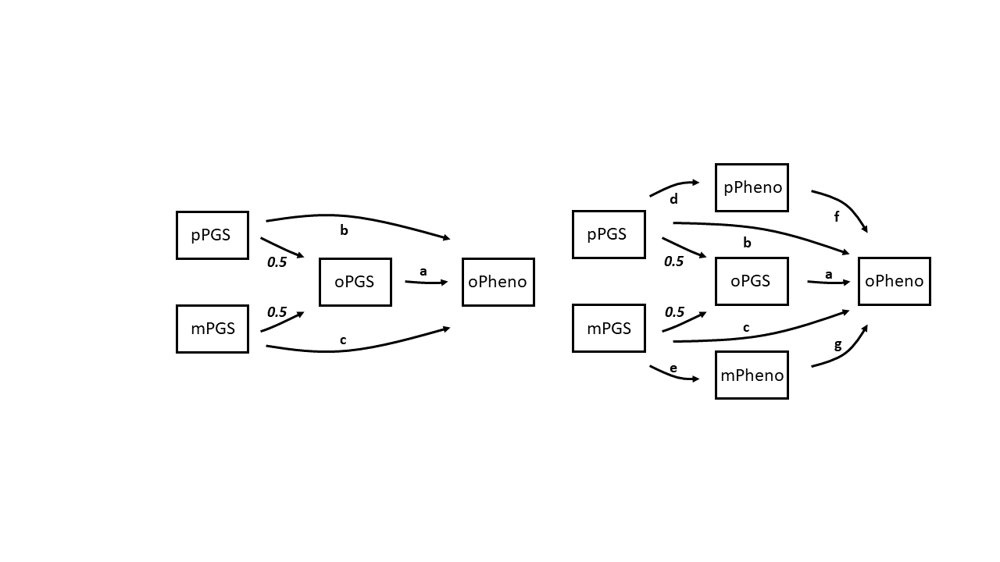

# GenerationScotland_rGE
## Keywords: Gene-Environment Correlations, Genetic Nurturing, Indirect Genetic Effects

# Project Description
Here we are exploring genetic nurturing effects using Generation Scotland Trios (biological parent-offspring members) using Polygenic Scores (PGS).

This figure from Kong and colleagues (2018) provides a neat visualisation of genetic nurturing effects. The figure essentially shows that parent genetics can shape offspring's rearing environment. Parental genetics are made up of genes that they *transmit* and that they do *not transmit*. The transmitted genes can have a *direct* effect by forming the offspring's own genome, which goes on to impact a trait of interest. Both the transmitted and non-transmitted genes can have *genetic nurturing* effect on the offspring, by influencing a parental trait which can go on to shape the offspring's rearing environment.  


It is important to understand and quanitify genetic nurturing effects at play. The translational aspect of this research would be identifying the mediating factors through which these genetic nurturing effects have an impact (e.g. the parental traits *Yp/Ym* shown in the figure above). Identifying the mechanism can provide clear targets for interventions aimed at individuals with heightened risk. 

It is evident from the literature that genetic nurturing effects can be detected using PGSs (see work from Augustine Kong, Rosa Cheesman etc) for traits with greater heritability estimates e.g. educational attainment. Here, we employ regression and pathway models using trio PGSs and phenotype data to explore genetic nurturing effects in **psychological distress**, **depression**, **educational attainment**, and **height**.

Here we show how PGSs are useful when exploring and quantifying genetic nurturing effects. However, when exploring the mechanisms of genetic nurturing i.e. identifying parental phenotypes which may shape offspring environment, PGSs fall short - and in fact result in confounding. 

Conducted simulations demonstrate that PGSs still being substantially underpowered for most complex traits, and the mediating variables explored being heritable result in genetic confounding. 

# Phenotypes

Research exploring parental genetic nurturing effects within **depression and psychological distress phenotypes** is minimal. Depression is a trait that is moderately heritabile ~30-40%. PGSs are strongly associated with depression/depression related phenotypes, but they account for very little (<3%) of the phenotypic variance.

In contrast **educational attainment** is a trait that has higher heritability and a relatively well powered GWAS, resulting in PGSs accounting for greater variance. Furthermore, genetic nurturing effects have been found using PGSs for EA within the literature (Kong et al., 2018, Cheesman et al., 2019, Domingue and Fletcher, 2020).

We also explore **height** as this is a highly heritable trait ~80% with GWAS that is well powered. The resulting PGSs account for much more variance than seen in EA and depression. Furthermore, based on the existing literature, it seems that genetic nurturing effects within height are negligible. 

More information and scripts on quality control and cleaning of phenotypes can be found in RealDataAnalyses.R R scripts.  


# Polygenic Scores

**GWAS summary statistics can requested or found online**

1. Depression GWAS (Howard et al., 2019) summary statistics used needs to be requested through 23&Me dataset-request@23andMe.com and the corresponding author D.Howard@ed.ac.uk https://www.med.unc.edu/pgc/download-results/mdd/ 
2. Educational Attainment GWAS (Lee et al., 2018) summary statistics can be found at https://www.thessgac.org/data
3. Height GWAS (Yengo et al., 2018) summary statistics are publically available at https://portals.broadinstitute.org/collaboration/giant/index.php/GIANT_consortium_data_files

*Note that depression PGSs were used when exploring psychological distress as well*

**LD Structure obtained from 1000 Genomes**

Phenotype data includes the residuals of the phenotype regressed onto covariates AGE and SEX `lm(phenotype~AGE+SEX)`.
Target data are plink Generation Scotland genotype files

Different PGSs are generated  whereby the number of SNPs used to inform the PGSs are dependent on the SNPs association strength with the trait. 10 different p-value association thresholds ranging from 5x10-8 : 1 are implemented.

The *PRSice* software (Choi & O'Reilly, 2015) is used to generate the PGSs, a tutorial is available online https://www.prsice.info/

```
#!/bin/sh
###########################################

# M.Chuong, Edinburgh U.K, January2020
# Eddie Polygenic Score Scripts

#$ -N GenScotPGS
#$ -cwd
#$ -pe sharedmem  # number of cores
#$ -l h_vmem=8G # memory per core
#$ -l h_rt=12:00:00 ## requested time
#$ -m baes ## notifications: (b)begin/(a)aborted/(e)end/(s)suspended/(n)nomail
#$ -M melisa.chuong@ed.ac.uk ## email for notifications

# INITIALISE ENV MODULES
. /etc/profile.d/modules.sh # if using modules need to add this line
# LOAD THE MODULES
module load igmm/apps/R/3.3.3

Rscript PRSice.R\ 
--dir .\ 
--prsice ./PRSice_linux\
--base <INSERT GWAS SUMSTATS HERE>\ 
--target <INSERT PLINK .BED .BIM .BAM FILES HERE>\ 
--thread 1\ 
--print-snp\ 
--beta\ 
--stat <INSERT STAT NAME>\ 
--binary-target <INSERT T OR F DEPENDENT ON YOUR PHENOTYPE>\ 
--snp <INSERT SNP NAME>\ 
--A1 <INSERT A1 NAME>\ 
--A2 <INSERT A2 NAME>\ 
--se <INSERT STANDARD ERROR NAMES>\ 
--pvalue <INSERT P-Val>\ 
--bar-levels 0.00000005,0.0000005,0.000005,0.00005,0.0005,0.005,0.05,0.5,0.75,1\ 
--fastscore\ 
--all-score\ 
--ld <INSERT LD STRUCTURE FILES .BED .BIM .BAM>\ 
--pheno-file <INSERT PHENOTYPE FILES>\ 
--pheno-col <PHENO COL NAME>\ 
--out <INSERT OUTPUT NAME>

```
  

# Statistical Analyses & Software Packages

**Packages**

Mixed effect regression models can be implemented using the software package lme4
```{r}
install.packages("lme4")
library(lme4)
```

Pathway models can be implemented using the software package lavaan
```{r}
install.packages("lavaan")
library(lavaan)
```

We aim to model the structure presented in Kong and colleagues (2018) figure (presented above) within regression and pathway models using trio PGSs capturing the genetic variance. Pathway models are different to regression models as they also capture chains of effects, or covariances between the different predictors included in the model. The difference between a regression and pathway model can be visualised with the figure below. 


**Regression Models**

Mixed effects regression models are a very simple way of exploring whether trio PGSs can pick up the present genetic nurturing effects. As our trio offsprings include siblings, we fix sibling effects as random. 2 models are implemented

*Model I: oPheno ~ oPGS + covariates*

*Model II: oPheno ~ oPGS + mPGS + pPGS + covariates*

Model *I* represents direct genetic effects (i.e. the genetic effects of parents that are transmitted to the offspring)

Model *II* represents direct and indirect genetic effects (the inclusion of the parental PGSs alongside the offspring PGSs suggest any additional variance captured by model *II* can be attributed to variance captured by the parental PGSs above the variance captured by the offspring PGSs only).  

Results show that model *II* is has a significantly better fit to the data for Educational Attainment only. This suggests that there is no evidence of genetic nurturing that can be picked up using PGSs in the other traits of interest.


**Pathway Models**

2 separate pathway models are implemented, simple and extended. 

The simple pathway model is essentially the equivalent of regression model *II*, capturing  both direct and indirect genetic effects using PGSs.  
As the variables (trio PGSs) are correlated, the beta coefficients should be interpreted with caution within the regression models. The pathway models explore associations independently, and thus, the coefficients can be thought to provide useful information on size and direction of associations.  

The extended pathway model aims to explore parental phenotype mediated genetic nurturing pathways.  
Coefficients of paths between parental PGSs and offspring PGSs are fixed to 0.5 to represent ~50% of shared genetic variance between parents and offspring.


Simple and Extended pathway models show interesting and in some cases contradicting results. 
For all traits except educational attainment, we either see NO (or very weak evidence) or genetic nurturing effects from the simple pathway model results. 
HOWEVER, we observe significant genetic nurturing effects mediated by parental phenotypes for all traits from the extended pathway models.  
Interestingly, we observe highly significant and *negative* genetic nurturing effects for height within the extended models.  

These results are difficult to interpret and point to potential confounding and biases introduced to the models with the inclusion of parental phenotype mediated genetic nurturing pathways. We hypothesise that these confounds are introduced as PGSs are poor measures of genetic variance, and moreover, parental phenotypes are likely acting as better measures of genetic variance. 

More discussion on results can be found in the manuscript.


# Simulation Analyses

The aim here is to simulate the genetic and phenotypic associations between members of a trio i.e. biological parents and a single offspring. 
As an overview, here we are simulating data for;
10,000 trio members
traits with varying heritability (0.3, 0.6, 0.9)
varying levels of tagged genetic variance (0.2, 0.6, 1)
varying levels of noise associated with PGSs (0-1)

To keep analyses simple and efficient we simulate the trio variables by sampling from pre-determined variances, rather than simulating individual genotypes.  
Transmitted and non-transmitted genetic variances are not separated in these simulations. 
Genetic nurturing effects are not included in these simulations.  

Simulated phenotypic variables had a variance of 1. 
Additive genetic variance was computed as the heritability multiplied by the phenotypic variance. 

Genetic variance was represented as two separate entities; tagged genetic variance, aiming to capture variance attributable to genotyped variants, and non-tagged genetic variance, aiming to capture variance attributable to non-genotyped variants. 
The tagged genetic variance was calculated as the additive genetic variance multiplied by a pre-specified value, resulting in the desired tagged genetic variance (this can also be thought of as SNP heritability when using real data).  
Non-tagged genetic variance would be the remaining genetic variance and was calculated as the difference between the additive genetic variance and tagged genetic variance. 

All remaining variance was attributed to environmental variance or noise associated with PGSs, calculated as the product of the phenotypic variance and the difference between one and the specified heritability value. 

An additional noise variance was specified aiming to capture inaccuracies/biases in variant beta effect sizes specified in GWAS due to the lack of statistical power, which go onto add noise to PGSs. This noise variance was assigned values starting from zero, with zero representing completely accurate beta effect sizes from . It is important to note that the value 1, does not mean the PGS is entirely noise. 

```{r}
  V_P <- 1 #phenotypic variance is = 1
  V_A <- h2*V_P #the heritability is equal to the additive genetic variance
  V_Tagged <- tagged*V_A #the value of tagged should be SNP heritability i.e. the proportion of the genetic variance that is actually tagged by measured variants
  V_nTagged <- V_A - V_Tagged
  V_E <- (1-h2)*V_P #the environmental variance
  n <- 10000 # simulating 10,000 trios
``` 

The parental genetic variables were constructed as the sum of tagged and non-tagged genetic counterparts. 
Tagged genetic variable values were simulated from a normal distribution with a mean of zero, and a variance of tagged genetic variance (pre-defined, but in reality would be ~ SNP heritability). 
Similarly, non-tagged genetic variable values were simulated from a normal distribution with a mean of zero, and a variance of non-tagged genetic variance

```{r}

  #Creating a parental genetic variables that captures ALL tagged genetic variance
  maternal_genetic_tagged = rnorm(n, mean=0, sqrt(V_Tagged))
  paternal_genetic_tagged = rnorm(n, mean=0, sqrt(V_Tagged))
  
  #Creating a parental genetic variable that captures ALL non-tagged genetic variance 
  maternal_genetic_ntagged = rnorm(n, mean=0, sqrt(V_nTagged))
  paternal_genetic_ntagged = rnorm(n, mean=0, sqrt(V_nTagged))
  
  #Creating a parental genetic variables that is the sum of the tagged and non-tagged genetic variance
  maternal_genetic = maternal_genetic_tagged + maternal_genetic_ntagged
  paternal_genetic = paternal_genetic_tagged + paternal_genetic_ntagged
  
```
Similarly, the offspring genetic variables were constructed as the sum of tagged and non-tagged genetic counterparts. Offspring tagged and non-tagged genetic variables were simulated as the average of the respective tagged and non-tagged maternal and paternal genetic variables, with the addition of a respective tagged and non-tagged segregation variable aiming to capture variability that occurs from random segregation of genes observed during meiosis (Yanowitz, 2010).  
The tagged and non-tagged segregation variable values were simulated from a normal distribution with a mean of zero and a variance of half the tagged and non-tagged genetic variance, respectively

```{r}

  #offspring segregation is generated to capture noise that occurs from genetic segregation
  #separate segregation terms are generated using tagged and non-tagged genetic variance
  offspring_segregation_tagged = rnorm(n, 0, sd=sqrt(V_Tagged/2))
  offspring_segregation_ntagged = rnorm(n, 0, sd=sqrt(V_nTagged/2))
  
  #separate offspring genetic counterparts are created using tagged and non-tagged genetic variance (including segregation variance) from each parent
  offspring_genetic_tagged = (maternal_genetic_tagged + paternal_genetic_tagged)/2 + offspring_segregation_tagged
  offspring_genetic_ntagged = (maternal_genetic_ntagged + paternal_genetic_ntagged)/2 + offspring_segregation_ntagged
  
  #final offspring genetic variable is created by summing the offspring genetic counterparts generated above
  offspring_genetic = offspring_genetic_tagged + offspring_genetic_ntagged
  
```
Separate environmental variables were constructed for each member of the trio. These variables were simulated from a normal distribution with a mean of zero, and variance of the pre-defined environmental variance.

```{r}
  
  #Creating parental environmental variables that capture the environmental variance
  maternal_environment = rnorm(n, mean=0, sd = sqrt(V_E))
  paternal_environment = rnorm(n, mean=0, sd = sqrt(V_E))
  
  #offspring environmental variable made up of environmental variance
  offspring_environment <- rnorm(n, mean=0, sd = sqrt(V_E))
```
The phenotypic variables for each member of the trio was then constructed as the sum of the respective trio member’s genetic and environmental variable values

```{r}

  #Creating parental phenotypic variables that is made up of both genetic and environmental variance
  maternal_phenotype = maternal_genetic + maternal_environment
  paternal_phenotype = paternal_genetic + paternal_environment
  
  #offspring phenotypic variable is the sum of the offspring genetic and environmental variables 
  offspring_phenotype <- offspring_genetic + offspring_environment
  
```  

Polygenic score variables were derived from the trio member's respective tagged genetic component, as PGSs can only be derived using genotyped variants when using real data.  
The PGSs also included a noise term aiming to represent noise that can arise from GWAS lacking power, resulting in beta estimates (effect sizes) of each variant being potentially inaccurate/biased. 

Parental noise variables were simulated from a normal distribution with a mean of zero, and a variance of the pre-defined noise variance (specified above).  
Maternal and paternal PGSs were subsequently calculated as the sum of the respective tagged genetic and noise variables. 

The noise component for the offspring PGSs was calculated as the average of the parental noise variables in order to capture noise correlation seen within families; as it is likely that families share a greater number of genetic variants, thus, sharing a greater number of variants with potentially biased estimates within their PGSs than with non-related individuals.  

Moreover, offspring PGSs further capture an independent noise component, simulated from a normal distribution with a mean of zero, and a variance of half the pre-specified noise variance. Thus, the offspring PGSs were calculated as the sum of the offspring tagged genetic, the average of the parental noise variables and the offspring’s independent noise variables. 

*Important to note here that this is a very simplistic representation of how GWAS inaccuracies have an impact on PGSs, ideally we would simulate a population, GWAS and individual genotypes to represent these effects as they occur in real life* 

```{r}

  #creating PRSs 
  #Estimates of the variant effect on the phenotype may not be accurate i.e. GWAS are still quite underpowered - we capture this with our varying V_noise parameter
  #Remember that the PRSs are purely derived from tagged genetic variance 
  V_noise = prs_noise
  
  #Creating parental PRSs where PRSs are derived of parental tagged genetic variables + noise derived using the noise variance variable created in the previous step
  maternal_noise = rnorm(n, 0, sd=sqrt(V_noise))
  maternal_prs = maternal_genetic_tagged + maternal_noise
  
  paternal_noise = rnorm(n, 0, sd=sqrt(V_noise)) 
  paternal_prs = paternal_genetic_tagged + paternal_noise 
  
  
  #Simulating offspring PRSs derived from offspring tagged genetic variable + noise derived from the average parental noise and offspring noise
  offspring_prs = offspring_genetic_tagged + rnorm(n, 0, sd=sqrt(V_noise/2)) + (maternal_noise + paternal_noise)/2
  
  #Creating a data.frame with all important variables included
  cohort <- data.frame(maternal_genetic, maternal_environment, maternal_phenotype, maternal_prs,
                       paternal_genetic, paternal_environment, paternal_phenotype, paternal_prs,
                       offspring_genetic, offspring_environment, offspring_phenotype, offspring_prs)
  return(cohort)}

```

Heritability (0.3, 0.6, 0.9), tagged genetic variance (0.2, 0.6, 1), the PGS noise (0-1, by 0.1 increments) are set as varying parameters.  

The scenarios in which `tagged genetic variance = 1` and `PGS noise = 0` shows findings where the PGSs capture ALL the genetic variance (basically **perfect** measures of genetics) available within the regression and pathway models. 

Here we have not simulated any genetic nurturing effects. We would expect highlighted path coefficients to be ~0 and non-significant. 
  

What we observe is that offspring pheno ~ parental phenotype path (*f* and *g*) coefficients are always upwardly biased and offspring pheno ~ parental PGS (paths *b* and *c*) associations are always downwardly biased, except for when PGSs are essentially perfect measures of genetic variance. 

Here we present results for paternal genetic nurturing paths from pathway models.
The same pattern of results is observed from regression models and maternal genetic nurturing pathway models as well!

Presented are results when PGSs include 0 noise (a.k.a a scenario where the GWAS is well powered and SNP effect sizes are accurate).
  

Presented are results which include varying levels of noise associated with the PGSs.
  

It is evident that **just** including trio PGSs within these models allow for an accurate (unbiased) quantification of genetic nurturing effects (as simulations did NOT include genetic nurturing effects, the coefficients were expected to be ~0, and figures show that!). 

However, **including** parental phenotypes to explore mechanisms of genetic nurturing results in downward and upward biases. These biases diminish when PGSs account for 100% of the genetic variance and are entirely accurate. This highlights that biased are a result of confouding induced by underpowered PGSs.

