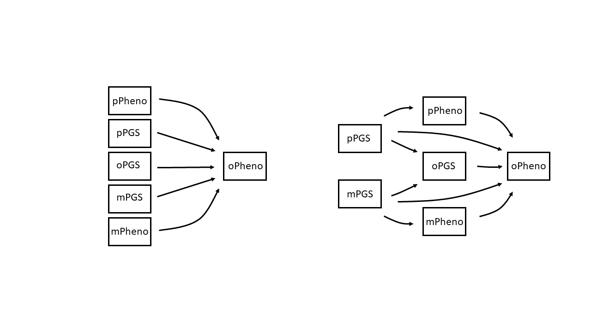

# GenerationScotland_rGE
## Keywords: Gene-Environment Correlations, Genetic Nurturing, Indirect Genetic Effects

# Project Description
Here we are exploring gene-environment correlations (rGE), also known as indirect genetic effects, within Generation Scotland Trios (offspring with both biological parents) using Polygenic Scores (PGS). 
rGE refers to *exposure* to certain environments that are driven by genetics. rGE in the context of biological trios can also be labelled as passive rGE or genetic nurturing. (Yes, I know - so MANY labels!)

This figure from Kong and colleagues (2018) provides a neat visualisation of genetic nurturing effects. The figure shows that parental genetics are made up of genes that they *transmit* and that they do *not transmit*. The transmitted genes can have both a *direct* and/or *genetic nurturing* effect on the offspring, whereas the non-transmitted genes can only exhibit genetic nurturing effects, if they have an effect at all:


It is important to understand whether traits such as depression have genetic nurturing effects at play. The translational aspect of this research would be identifying the mediating factors through which these genetic nurturing effects have an impact (e.g. the parental traits *Yp/Ym* shown in the figure above). Identifying the mechanism can provide clear targets for interventions aimed at individuals with heightened risk. 

In this project we employ regression and pathway models using PGSs to explore these genetic nurturing effects. It is evident from the literature that genetic nurturing effects can be detected using PGSs (see work from Augustine Kong, Rosa Cheesman etc). The use of PGSs have substantial benefits such as allowing a vast amount of genetic data to be aggregated into a single score for each individual, which is useful for subsequent downstream statistical analyses. Here we show how PGSs are useful when exploring the presence of genetic nurturing effects. However, when exploring variables through which these effects have an impact, PGSs fall short. Conducted simulations demonstrate that PGSs still being substantially underpowered for most complex traits, and the mediating variables explored being heritable result in genetic confounding. 

# Phenotypes

In this project we will be exploring depression, psychological distress, educational attainment (EA) and height phenotypes. 

Research exploring gene-environment correlations within **depression and psychological distress phenotypes** is minimal. Depression is a trait that is moderately heritabile ~30-40%, and PGSs generated are still substantially underpowered. Detection of genetic nurturing effects may be difficult with the PGSs available.

In contrast **EA** is a trait that has higher heritability and a relatively well powered GWAS, resulting in PGSs accounting for greater variance. Furthermore, genetic nurturing effects have been found using PGSs for EA within the literature (Kong et al., 2018, Cheesman et al., 2019, Domingue and Fletcher, 2020).

We also explore **height** as this is a highly heritable trait ~80% with GWAS that is well powered. The resulting PGSs account for much more variance than seen in EA and depression. Furthermore, evidence suggests that there may be genetic nurturing effects at play for height (Laurence et al., 2021), although we hypothesised these effects to be negligible. 

More information and scripts on quality control and cleaning of phenotypes can be found in *Real Data* folder. 

# Polygenic Scores

**GWAS summary statistics can requested or found online**

1. Depression GWAS (Howard et al., 2019) summary statistics used needs to be requested through 23&Me dataset-request@23andMe.com and the corresponding author D.Howard@ed.ac.uk https://www.med.unc.edu/pgc/download-results/mdd/ 
2. Educational Attainment GWAS (Lee et al., 2018) summary statistics can be found at https://www.thessgac.org/data
3. Height GWAS (Yengo et al., 2018) summary statistics are publically available at https://portals.broadinstitute.org/collaboration/giant/index.php/GIANT_consortium_data_files

**LD Structure obtained from 1000 Genomes**

Phenotype data includes the residuals of the phenotype regressed onto covariates AGE and SEX `lm(phenotype~AGE+SEX)`.
Target data are plink Generation Scotland genotype files

Different PGSs are generated  whereby the number of SNPs used to inform the PGSs are dependent on the SNPs association strength with the trait. 10 different p-value association thresholds ranging from 5x10-8 : 1 are implemented.

The *PRSice* software (Choi & O'Reilly, 2015) is used to generate the PGSs, a tutorial is available online https://www.prsice.info/

```
#!/bin/sh
###########################################

# M.Chuong, Edinburgh U.K, January2020
# Eddie Polygenic Score Scripts

#$ -N GenScotPGS
#$ -cwd
#$ -pe sharedmem  # number of cores
#$ -l h_vmem=8G # memory per core
#$ -l h_rt=12:00:00 ## requested time
#$ -m baes ## notifications: (b)begin/(a)aborted/(e)end/(s)suspended/(n)nomail
#$ -M melisa.chuong@ed.ac.uk ## email for notifications

# INITIALISE ENV MODULES
. /etc/profile.d/modules.sh # if using modules need to add this line
# LOAD THE MODULES
module load igmm/apps/R/3.3.3

Rscript PRSice.R\ 
--dir .\ 
--prsice ./PRSice_linux\
--base <INSERT GWAS SUMSTATS HERE>\ 
--target <INSERT PLINK .BED .BIM .BAM FILES HERE>\ 
--thread 1\ 
--print-snp\ 
--beta\ 
--stat <INSERT STAT NAME>\ 
--binary-target <INSERT T OR F DEPENDENT ON YOUR PHENOTYPE>\ 
--snp <INSERT SNP NAME>\ 
--A1 <INSERT A1 NAME>\ 
--A2 <INSERT A2 NAME>\ 
--se <INSERT STANDARD ERROR NAMES>\ 
--pvalue <INSERT P-Val>\ 
--bar-levels 0.00000005,0.0000005,0.000005,0.00005,0.0005,0.005,0.05,0.5,0.75,1\ 
--fastscore\ 
--all-score\ 
--ld <INSERT LD STRUCTURE FILES .BED .BIM .BAM>\ 
--pheno-file <INSERT PHENOTYPE FILES>\ 
--pheno-col <PHENO COL NAME>\ 
--out <INSERT OUTPUT NAME>

```
# Statistical Analyses & Software Packages

**Packages**

Mixed effect regression models can be implemented using the software package lme4
```{r}
install.packages("lme4")
library(lme4)
```

Pathway models can be implemented using the software package lavaan
```{r}
install.packages("lavaan")
library(lavaan)
```

We aim to model the structure presented in Kong and colleagues (2018) figure (presented above) within regression and pathway models using trio PGSs capturing the genetic variance. Pathway models are different to regression models as they also capture chains of effects, or covariances between the different predictors included in the model. The difference between a regression and pathway model can be visualised with the figure below. 


**Regression Models**

Mixed effects regression models are a very simple way of exploring whether trio PGSs can pick up the present genetic nurturing effects. As our trio offsprings include siblings, we fix sibling effects as random. 2 models are implemented

*Model A: off Pheno ~ oPGS + covariates*

*Model B: Off Pheno ~ oPGS + mPGS + pPGS + covariates*

Model A represents direct genetic effects (i.e. the genetic effects of parents that are transmitted to the offspring)

Model B represents direct and indirect genetic effects (the inclusion of the parental PGSs alongside the offspring PGSs suggest any additional variance captured by model B can be attributed to variance captured by the parental PGSs above the variance captured by the offspring PGSs only)

**Pathway Models**

2 separate pathway models are implemented, simple and extended. 

The simple pathway model is essentially the equivalent of regression model B, capturing  both direct and indirect genetic effects using PGSs. 

The extended pathway model aims to explore parental phenotype mediated genetic nurturing pathways. 


More information and scripts on how the regression and pathway models are implemented for each phenotype can be found in the *Real Data* folder. 

# Simulation Analyses

The aim here is to simulate the genetic and phenotypic associations between members of a trio i.e. biological parents and a single offspring. To keep analyses simple and efficient we simulate the trio effects in variances rather than simulating individual genotypes. Transmitted and non-transmitted genetic variances are not separated in these simulations. Genetic nurturing effects are not included in these simulations. 

A phenotypic variance of 1 is specified. The additive genetic variance is specified as the heritability multiplied by the phenotypic variance; so in our simulations the additive genetic variance is always equal to the heritability. The genetic variance is made up of tagged and non-tagged genetic variance, the tagged genetic variance aims to represent SNP heritability. Remaining variance is attributed to the environment.

```{r}
  V_P <- 1 #phenotypic variance is = 1
  V_A <- h2*V_P #the heritability is equal to the additive genetic variance
  V_Tagged <- tagged*V_A #the value of tagged should be SNP heritability i.e. the proportion of the genetic variance that is actually tagged by measured variants
  V_nTagged <- V_A - V_Tagged
  V_E <- (1-h2)*V_P #the environmental variance
  n <- 10000 # simulating 10,000 trios
  
``` 

As mentioned above, genetic variables consist of tagged and non-tagged counterparts. 

```{r}

  #Creating a parental genetic variables that captures ALL tagged genetic variance
  maternal_genetic_tagged = rnorm(n, mean=0, sqrt(V_Tagged))
  paternal_genetic_tagged = rnorm(n, mean=0, sqrt(V_Tagged))
  
  #Creating a parental genetic variable that captures ALL non-tagged genetic variance 
  maternal_genetic_ntagged = rnorm(n, mean=0, sqrt(V_nTagged))
  paternal_genetic_ntagged = rnorm(n, mean=0, sqrt(V_nTagged))
  
  #Creating a parental genetic variables that is the sum of the tagged and non-tagged genetic variance
  maternal_genetic = maternal_genetic_tagged + maternal_genetic_ntagged
  paternal_genetic = paternal_genetic_tagged + paternal_genetic_ntagged
  
```
The offspring genetic variables are the average of the parental genetic variables, they also include a segregation term coined for both tagged and non-tagged genetic components. The segregation term aims to capture the variability that occurs from random segregation of genes observed during meiosis.

```{r}

  #offspring segregation is generated to capture noise that occurs from genetic segregation
  #separate segregation terms are generated using tagged and non-tagged genetic variance
  offspring_segregation_tagged = rnorm(n, 0, sd=sqrt(V_Tagged/2))
  offspring_segregation_ntagged = rnorm(n, 0, sd=sqrt(V_nTagged/2))
  
  #separate offspring genetic counterparts are created using tagged and non-tagged genetic variance (including segregation variance) from each parent
  offspring_genetic_tagged = (maternal_genetic_tagged + paternal_genetic_tagged)/2 + offspring_segregation_tagged
  offspring_genetic_ntagged = (maternal_genetic_ntagged + paternal_genetic_ntagged)/2 + offspring_segregation_ntagged
  
  #final offspring genetic variable is created by summing the offspring genetic counterparts generated above
  offspring_genetic = offspring_genetic_tagged + offspring_genetic_ntagged
  
```
Environmental variables are generated

```{r}
  
  #Creating parental environmental variables that capture the environmental variance
  maternal_environment = rnorm(n, mean=0, sd = sqrt(V_E))
  paternal_environment = rnorm(n, mean=0, sd = sqrt(V_E))
  
  #offspring environmental variable made up of environmental variance
  offspring_environment <- rnorm(n, mean=0, sd = sqrt(V_E))
```
Phenotype variables are generated by summing the genetic and environmental variables for each trio member

```{r}

  #Creating parental phenotypic variables that is made up of both genetic and environmental variance
  maternal_phenotype = maternal_genetic + maternal_environment
  paternal_phenotype = paternal_genetic + paternal_environment
  
  #offspring phenotypic variable is the sum of the offspring genetic and environmental variables 
  offspring_phenotype <- offspring_genetic + offspring_environment
  
```  

Polygenic scores variables are derived from the trio member's respective *tagged* genetic components only as it is implausible for PGSs to capture non-tagged genetic variance in real life. The PGSs also include a noise term aiming to capture the inaccuracy and noise seen in PGSs in real world terms - this noise usually arises from GWAS lacking power, thus, beta estimates (effect sizes) of each variant being inaccurate. 

The offspring PGSs further entail the average of the parents PGS noise - this aims to capture noise correlation within families as it is likely that families share a greater number of genetic variants, hence potentially sharing a greater number of variants with inaccurate estimates within their PRSs than with non-related individuals.  

```{r}

  #creating PRSs 
  #Estimates of the variant effect on the phenotype may not be accurate i.e. GWAS are still quite underpowered - we capture this with our varying V_noise parameter
  #Remember that the PRSs are purely derived from tagged genetic variance 
  V_noise = prs_noise
  
  #Creating parental PRSs where PRSs are derived of parental tagged genetic variables + noise derived using the noise variance variable created in the previous step
  maternal_noise = rnorm(n, 0, sd=sqrt(V_noise))
  maternal_prs = maternal_genetic_tagged + maternal_noise
  
  paternal_noise = rnorm(n, 0, sd=sqrt(V_noise)) 
  paternal_prs = paternal_genetic_tagged + paternal_noise 
  
  
  #Simulating offspring PRSs derived from offspring tagged genetic variable + noise derived from the average parental noise and offspring noise
  offspring_prs = offspring_genetic_tagged + rnorm(n, 0, sd=sqrt(V_noise/2)) + (maternal_noise + paternal_noise)/2
  
  #Creating a data.frame with all important variables included
  cohort <- data.frame(maternal_genetic, maternal_environment, maternal_phenotype, maternal_prs,
                       paternal_genetic, paternal_environment, paternal_phenotype, paternal_prs,
                       offspring_genetic, offspring_environment, offspring_phenotype, offspring_prs)
  return(cohort)}

```

Heritability (0.3, 0.6, 0.9), tagged genetic variance (0.2, 0.6, 1), the PGS noise (0-1, by 0.1 increments) are set as varying parameters.
The scenarios in which `tagged genetic variance = 1` and `PGS noise = 0` shows findings where the PGSs capture ALL the genetic variance (basically **perfect** measures of genetics) available within the regression and pathway models. 

More information and scripts on how the regression and pathway models are implemented using simulated data can be found in *Simulations* folder. 

